# Nuclear Music Player

Free music player that streams from any source. Search for music, and Nuclear plays it. Runs on Windows, macOS, and Linux.

## Screenshots

<p align="center">
  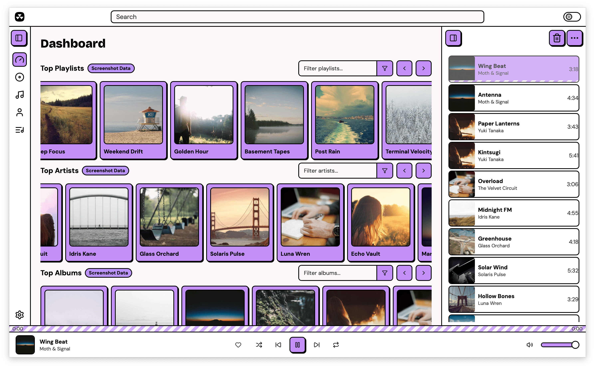
</p>

Nuclear comes with multiple built-in themes:

<p align="center">
  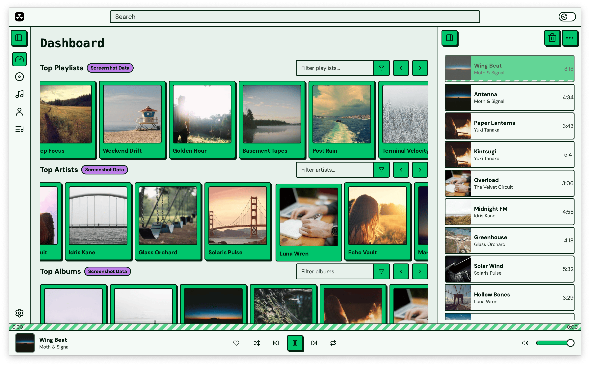
  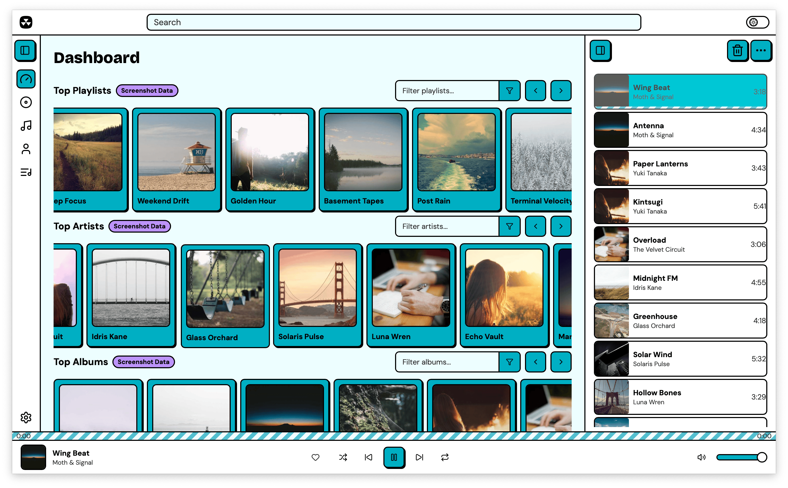
  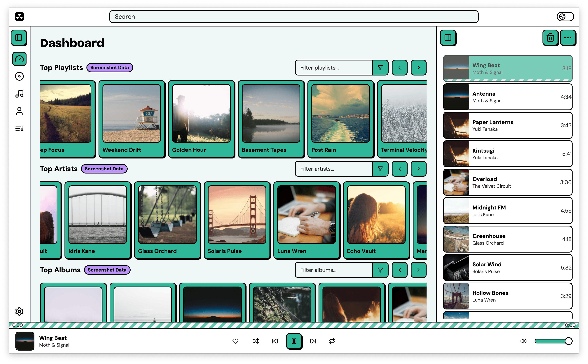
</p>
<p align="center">
  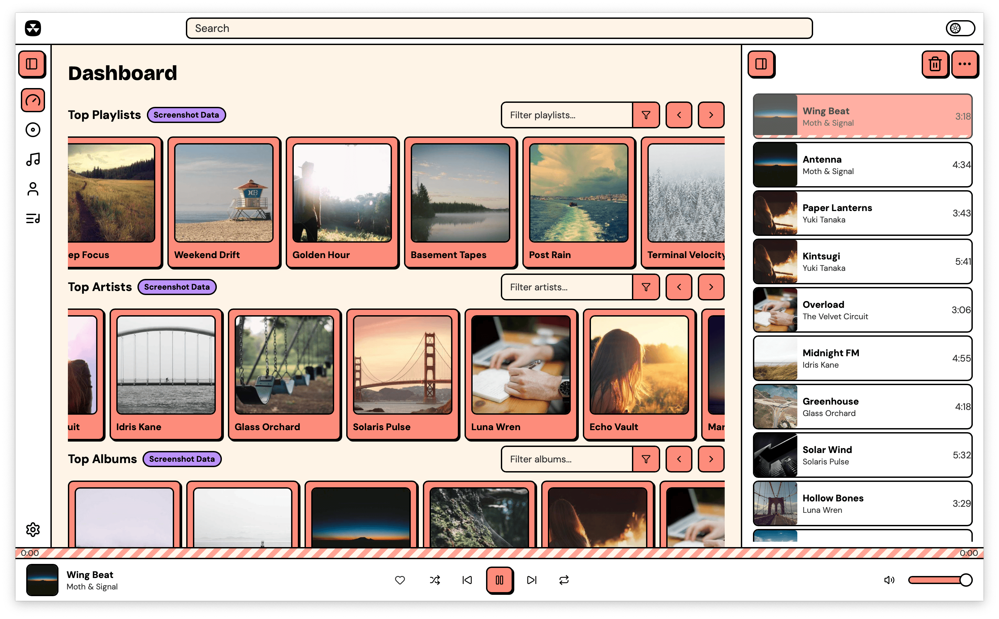
  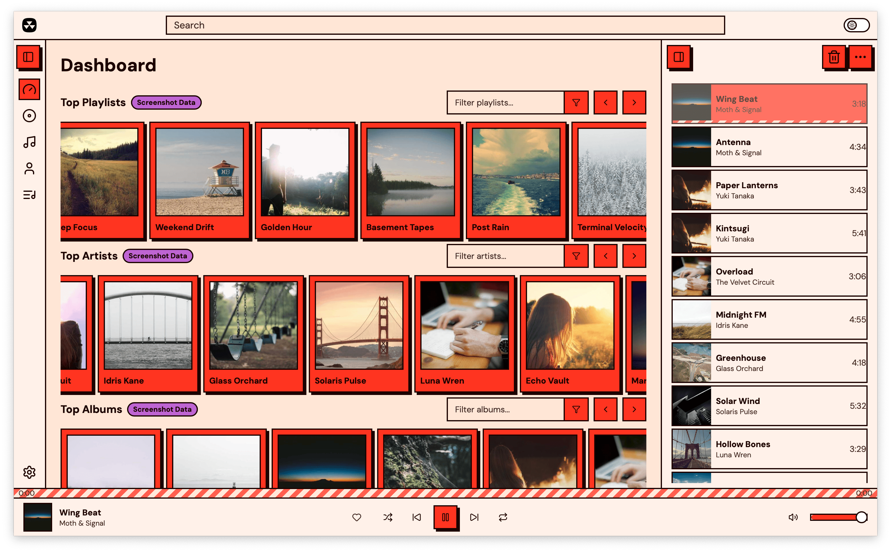
  
</p>

| | |
|:---:|:---:|
| 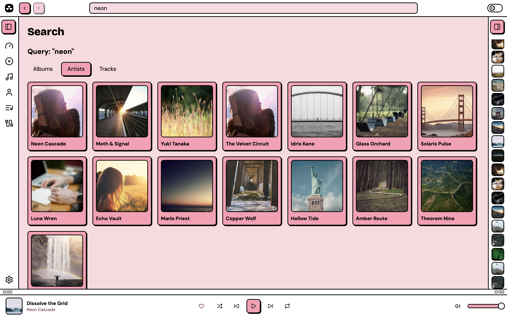 | 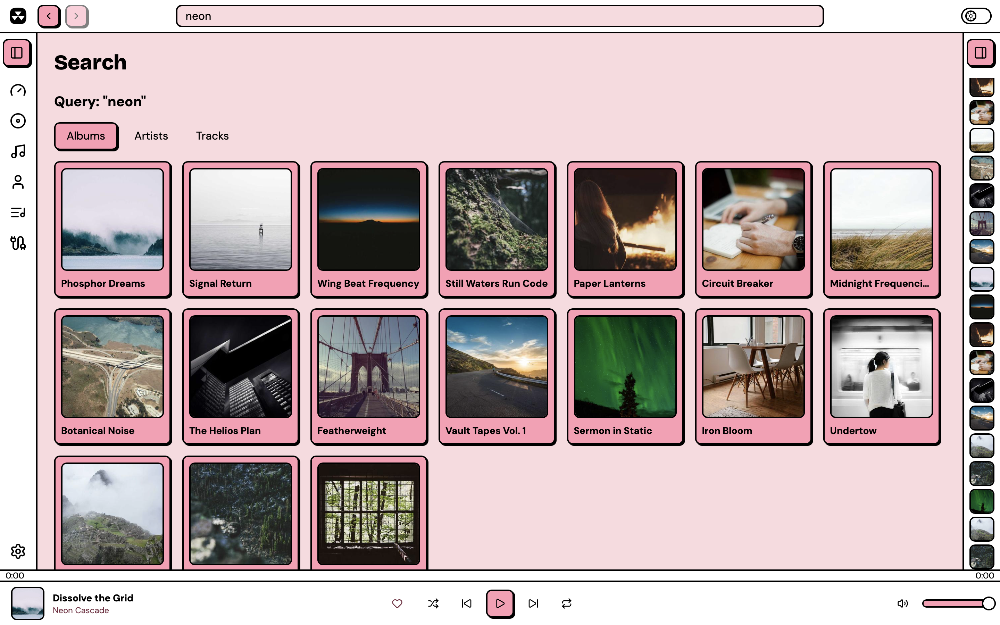 |
| Artist search | Album search |
| 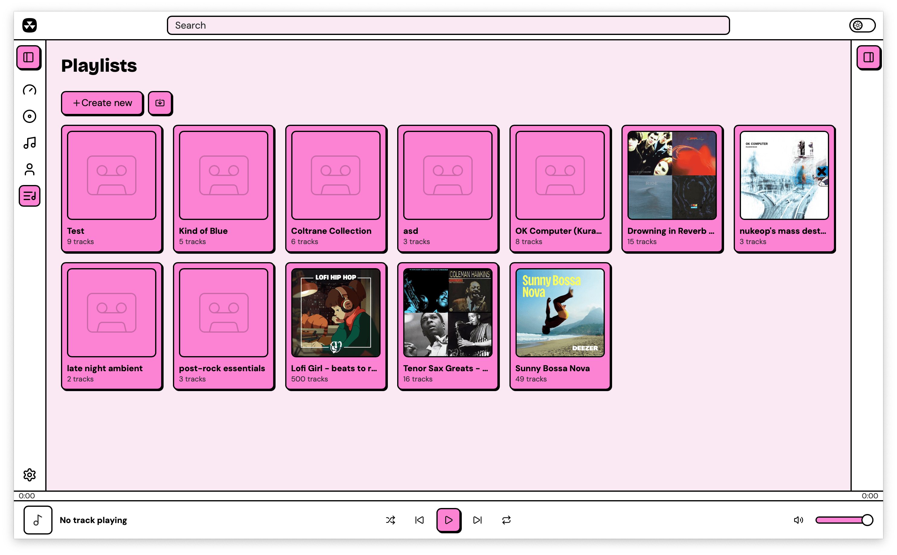 | 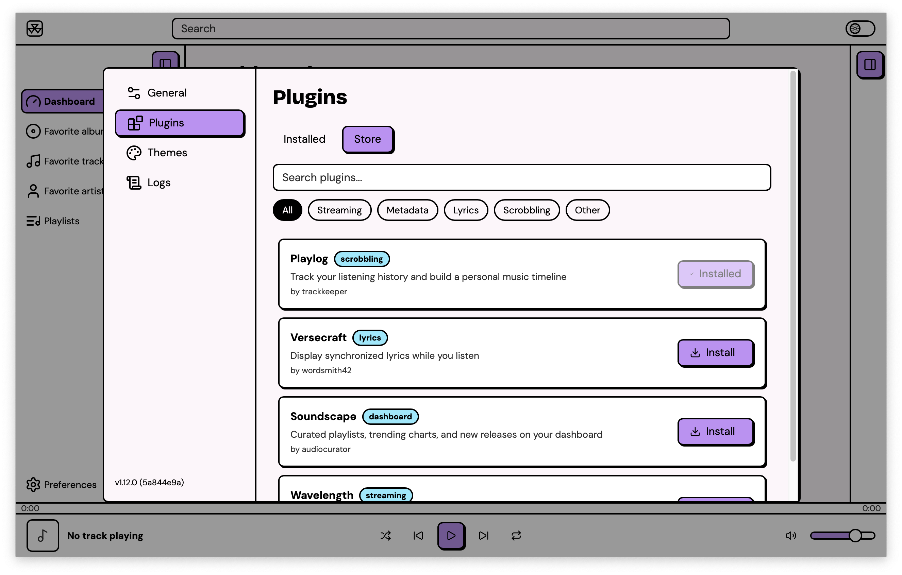 |
| Playlists | Plugin store |
| 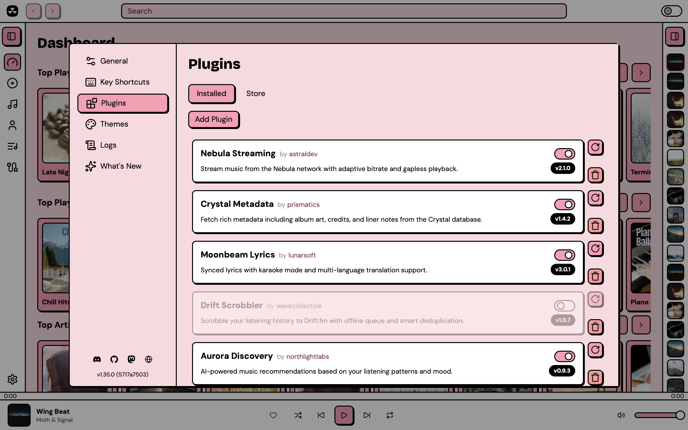 | 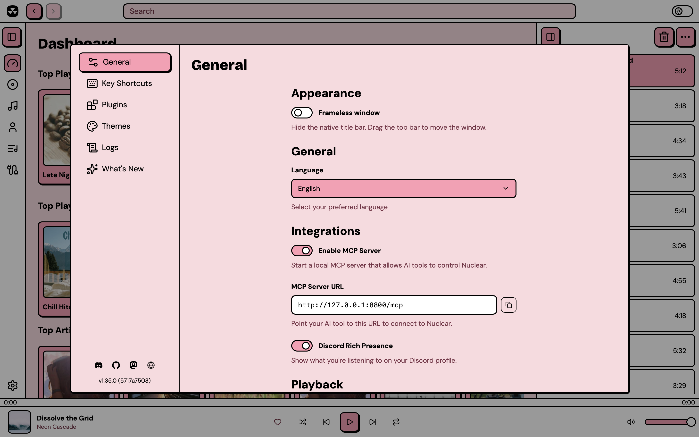 |
| Installed plugins | Preferences |
| 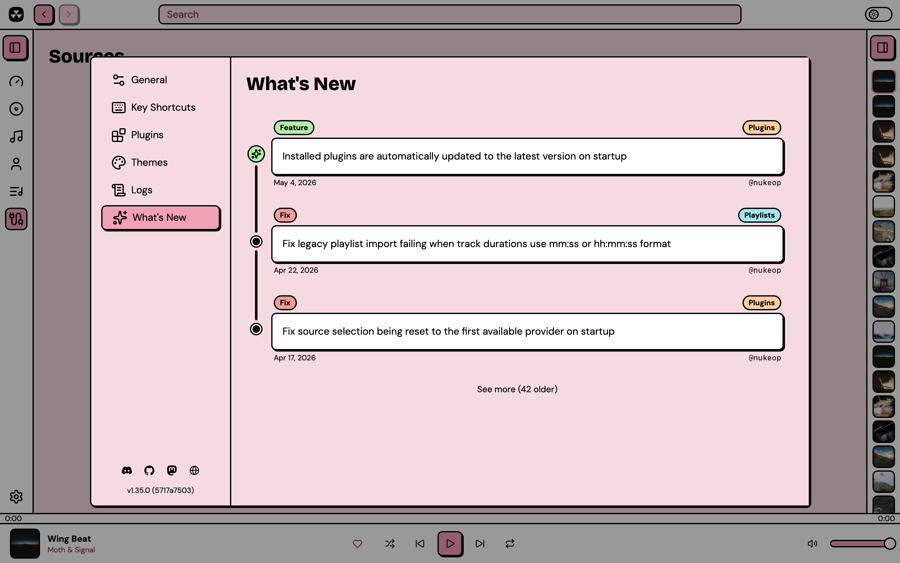 | 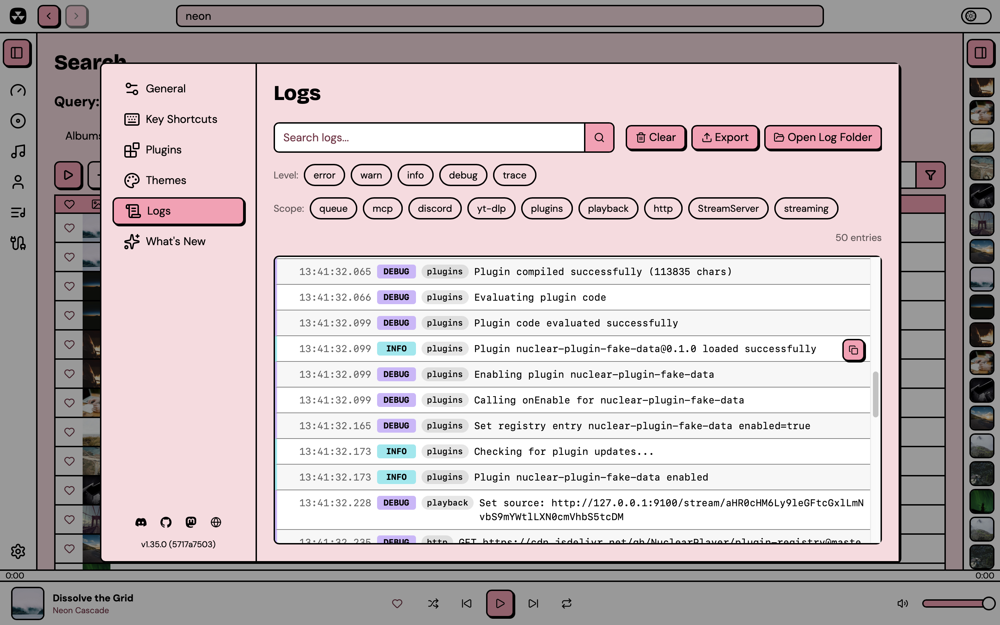 |
| What's new | Log viewer |

## Download

Grab the latest release for your platform from the [Releases page](https://github.com/nukeop/nuclear/releases).

| Platform | Formats |
|----------|---------|
| Windows | `.exe` installer, `.msi` |
| macOS | `.dmg` (Apple Silicon and Intel) |
| Linux | `.AppImage`, `.deb`, `.rpm`, `.flatpak` |

## Features

- Search for music and stream it from any source
- Browse artist pages with biographies, discographies, and similar artists
- Browse album pages with track listings
- Queue management with shuffle, repeat, and drag-and-drop reordering
- Favorites (albums, artists, and tracks)
- Playlists (create, import, export, import from varous services)
- Powerful plugin system with a built-in plugin store
- Themes (built-in and custom CSS themes)
- MCP server lets your AI agent drive the player
- Auto-updates
- Keyboard shortcuts
- Localized in multiple languages

## Plugins

Nuclear has a powerful plugin system now! Every functionality has been redesigned to be driven by plugins.

Plugins can provide streaming sources, metadata, playlists, dashboard content, and more. Browse and install plugins from the built-in plugin store, or write your own using the [@nuclearplayer/plugin-sdk](https://www.npmjs.com/package/@nuclearplayer/plugin-sdk).

## MCP

You can enable the MCP server in Settings → Integrations.

Then to add it to **Claude Code:**

```bash
claude mcp add nuclear --transport http http://127.0.0.1:8800/mcp
```

**Codex CLI:**

```bash
codex mcp add nuclear --url http://127.0.0.1:8800/mcp
```

**OpenCode:**

```json
{
  "mcp": {
    "nuclear": {
      "type": "remote",
      "url": "http://127.0.0.1:8800/mcp"
    }
  }
}
```

**Claude Desktop / Cursor / Windsurf:**

```json
{
  "mcpServers": {
    "nuclear": {
      "url": "http://127.0.0.1:8800/mcp"
    }
  }
}
```

The MCP is designed to be discoverable, but there's a skill you can load to get your AI up to speed: [Nuclear MCP Skill](./packages/docs/public/skills/nuclear-mcp.zip)

## Development

Nuclear is a pnpm monorepo managed with Turborepo. The main app is built with Tauri (Rust + React).

### Prerequisites

- Node.js >= 22
- pnpm >= 9
- Rust (stable)
- Platform-specific Tauri dependencies ([see Tauri docs](https://v2.tauri.app/start/prerequisites/))

### Getting started

```bash
git clone https://github.com/nukeop/nuclear.git
cd nuclear
pnpm install
pnpm dev
```

### Useful commands

```bash
pnpm dev            # Run the player in dev mode
pnpm build          # Build all packages
pnpm test           # Run all tests
pnpm lint           # Lint all packages
pnpm type-check     # TypeScript checks
pnpm storybook      # Run Storybook
```

## Community

- [Discord](https://discord.gg/JqPjKxE)
- [Mastodon](https://fosstodon.org/@nuclearplayer)
- [Discussions](https://github.com/nukeop/nuclear/discussions)

## License

AGPL-3.0. See [LICENSE](LICENSE).
