<h1> Improved </h1>

#  
[](https://codeclimate.com/github/nukeop/nuclear/maintainability) [](https://www.codacy.com/app/nukeop/nuclear?utm_source=github.com&amp;utm_medium=referral&amp;utm_content=nukeop/nuclear&amp;utm_campaign=Badge_Grade) [](https://snapcraft.io/nuclear) 

Ein Musikplayer für Computer, mit kostenlosem Streaming.


# Links

[Offizielle Webseite](https://nuclearplayer.com)

[Mastodon](https://fosstodon.org/@nuclearplayer)

[Twitter](https://twitter.com/nuclear_player)

Supportkanal (Matrix): `#nuclear:matrix.org`

Discordkanal: https://discord.gg/JqPjKxE

Readme Übersetzungen: 

<kbd>[](README-ptbr.md)</kbd>
<kbd>[](README-se.md)</kbd>
<kbd>[](../README.md)</kbd>
<kbd>[](README-he.md)</kbd>
<kbd>[](README-it.md)</kbd>
<kbd>[](docs/README-id.md)</kbd>
<kbd>[](docs/README-fr.md)</kbd>

## Was genau ist nuclear?
nuclear ist ein kostenloser Streaming-Dienst, welcher seinen Inhalt aus kostenlosen Quellen aus dem Internet entnimmt.

Wenn Ihnen [mps-youtube](https://github.com/mps-youtube/mps-youtube) bekannt vor kommt, können sie sich ungefähr vorstellen was nuclear dem macht, jedoch mit dem Vorteil, dass es eine grafische Oberfläche besitzt.
Man kann sagen, dass es so wie Spotify ist, jedoch mit einer größeren und vor allem kostenlosen Musikbibliothek.

## Was ist, wenn mir Electron nicht besonders gefällt?
Schauen Sie sich [das](docs/electron.md) an.

## Eigenschaften von nuclear

- Suche und Wiedergabe von Musik von YouTube (einschließlich Integration von Playlists und [SponsorBlock](https://sponsor.ajay.app/)), Jamendo, Audius und SoundCloud)
- Suche nach Alben (unterstützt von Last.fm und Discogs), Albenansicht, automatischer Liedsuche basierend auf Künstler- und Liedname (in Arbeit, kann etwas holprig sein)
- Musikwarteschlange, die bei Bedarf, als Playlist exportiert werden kann
- Aufrufen gespeicherter Playlists (als json Datei(en) gespeichert)
- Unterstützung von Last.fm scrobbling (inklusive Aktualisierung des 'spielt jetzt' status)
- Neueste Veröffentlichungen mit Rezensionen - Lieder und Alben
- Suchen nach Art 
- Radiomodus (automatisches Einreihen ähnlicher Lieder)
- Unlimitierte Downloads (unterstützt von Youtube)
- Wiedergabe von Songtexte in Echtzeit
- Vorschau von derzeitiger Beliebtheit
- Liste mit Lieblingsliedern
- Abspielen der eigenen Lokalen Bibliothek
- Keine Konten
- Keine Werbung
- Kein CoC (Verhaltenskodex)
- Kein CLA (Vereinbarung für Mitwirkende)

## Anleitungen
https://nuclearmusic.rtfd.io/

## Community-verwaltete Pakete

Hier ist eine Liste, die Pakete von Drittanbieter für die meisten Betriebsysteme beeinhaltet. Die Meisten, werden von den Veröffentlichern instandgehalten. Wir bedanken uns rechtherzlich für die Bereitstellung dieser Pakete.

| Pakettyp  | Link                                                    | Instandhalter                                    |
|:--------------:|:-------------------------------------------------------:|:---------------------------------------------:|
| AUR (Arch)     | https://aur.archlinux.org/packages/nuclear-player-bin/  | [advaithm](https://github.com/advaithm)       |
| AUR (Arch)     | https://aur.archlinux.org/packages/nuclear-player-git   | [advaithm](https://github.com/advaithm)       |
| Choco (Win)    | https://chocolatey.org/packages/nuclear/                | [JourneyOver](https://github.com/JourneyOver) |
| Homebrew (Mac) | https://formulae.brew.sh/cask/nuclear                   | Homebrew                                      |
| Snap           | https://snapcraft.io/nuclear                            | [nukeop](https://github.com/nukeop)           |
| Flatpak        | https://flathub.org/apps/details/org.js.nuclear.Nuclear  | [advaithm](https://github.com/advaithm)       |

Vielen Dank übrigens an [ayyeve](https://github.com/ayyEve), die mich (advaithm), ihren Server als Kompiliermaschine benutzen gelassen hat.
## Community Übersetzungen
Nuclear wurde bereits in vielen Sprachen übersetzt, dennoch sind wir weiterhin auf der Suche, nach neuen Mitwirkenden, die neue Sprachen hinzufügen wollen oder die Qualität des Inhaltes oder ähnliches verbessern möchten. Hier ist eine Liste von derzeitigen verfügbaren Sprachen, sowie deren Übersetzern.

| Sprache             | Mitwirkender                                                                                          |
|:--------------------:|:----------------------------------------------------------------------------------------------------:|
| Englisch              | N/A                                                                                                  |
| Französisch               | [charjac](https://github.com/charjac), [Zalax](https://github.com/Zalaxx)                            |
| Niederländisch                | [Vistaus](https://github.com/Vistaus)                                                                |
| Dänisch               | [Hansen1992](https://github.com/Hansen1992)                                                          |
| Spanisch              | [mlucas94](https://github.com/mlucas94), [emlautarom1](https://github.com/emlautarom1)               |
| Polisch               | [kazimierczak-robert](https://github.com/kazimierczak-robert), [gradzka](https://github.com/gradzka) |
| Deutsch               | [nuclear](https://github.com/nuclear), [schippas](https://github.com/schippas)                                                              |
| Russisch              | [ramstore07](https://github.com/ramstore07), [dmtrshat](https://github.com/dmtrshat)                 |
| Brazilianisches Portugiesisch | [JoaoPedroMoraes](https://github.com/JoaoPedroMoraes)                                                |
| Türkisch              | [3DShark](https://github.com/3DShark)                                                                |
| Italienisch             | [gello94](https://github.com/gello94)                                                                |
| Slovakisch               | [MartinT](https://github.com/MartinTuroci)                                                           |
| Tschechisch                | [PetrTodorov](https://github.com/PetrTodorov)                                                        |
| Tagalog              | [giftofgrub](https://github.com/giftofgrub)                                                          |
| Traditionelles Chinesisch  | [oxygen-TW](https://github.com/oxygen-TW)                                                            |
| Schwedisch              | [PalleKarlsson](https://github.com/PalleKarlsson), [nonew-star](https://github.com/nonew-star)                                                    |
| Grieschich                | [Shuin-San](https://github.com/Shuin-San)                                                            |
| Vietnamesisch           | [HaiDang666](https://github.com/HaiDang666)                                                          |
| Finnisch              | [cjola002-xamk](https://github.com/cjola002-xamk)                                                    |


## Entwicklungsprozess

Schauen Sie sich bitte als erstes die [Wiki Seite für Beitragende](https://github.com/nukeop/nuclear/wiki/Contributing) an.

Npm:
```shell
$ npm install # installs dependencies
$ npm start
```

Ein neues Fenster sollte sich öffnen, welches das Programm herunterlädt und nuclear startet.

---
Um für das aktuelle Betriebssystem zu kompilieren:
```shell
$ lerna bootstrap
$ npm run build
```

Anstelle von `build` können Sie auch `build:all` verwenden, um für alle Betriebsysteme zu kompilieren. Die Dateien werden sich in `packages/app/release` befinden.

---
Es ist auch möglich, die Entwicklungsumgebung, mithilfe eines "Docker Containers" zu nutzen, diese ist jedoch noch in der Entwicklungsphase.

`docker` und `docker-compose` werden benötigt. Sie müssen dem root user eine Verbindung zum X11 Display erlauben, danach können Sie `docker-compose` verwenden.

```shell
$ xhost SI:localuser:root
$ sudo docker-compose up dev
```
Ab sofort, ist es auch möglich eine Flatpak Version zu kompilieren. Dazu müssen gobject-introspection und flatpak-builder installiert sein. Für den Kompilierungsprozess müssen Sie, die für flatpak-buider erforderlichen Laufzeiten und Abhängigkeiten installieren. Sie benötigen die 19.08 Version dieser Flatpaks.
```shell
$ flatpak install flathub org.freedesktop.Platform
$ flatpak install flathub org.freedesktop.Sdk
$ flatpak install flathub io.atom.electron.BaseApp
```
Als nächstes, um das Projekt zu kompilieren: (Sie können den Parameter `--verbose` benutzen, dieser dient für eine detaillierte Ausgabe)
```shell
$ flatpak-builder build-dir org.js.nuclear.Nuclear.json
```
Um das kompilierte Programm zu starten:
```shell
$ flatpak-builder --run build-dir org.js.nuclear.Nuclear.json run.sh
```
Sie können das Programm auf eine lokale Quelle ansetzen. Momentan kompiliert die Datei die aktuellste Veröffentlichung.

## Screenshots
This will be updated as the program evolves.

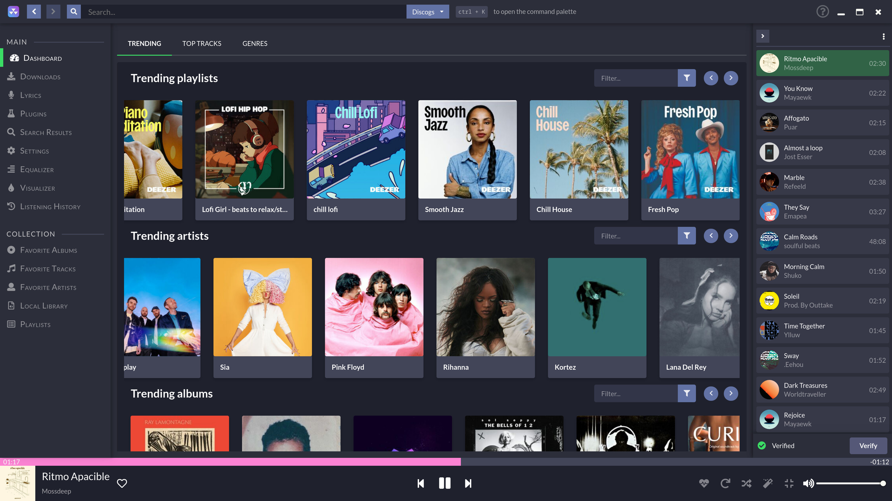

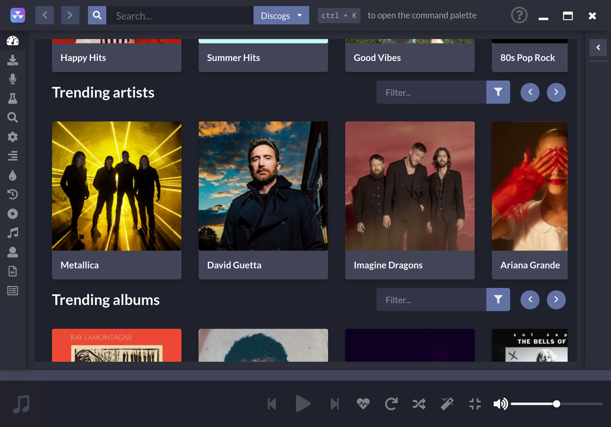

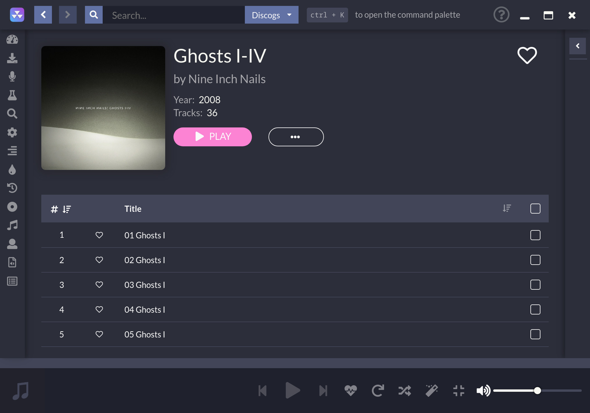

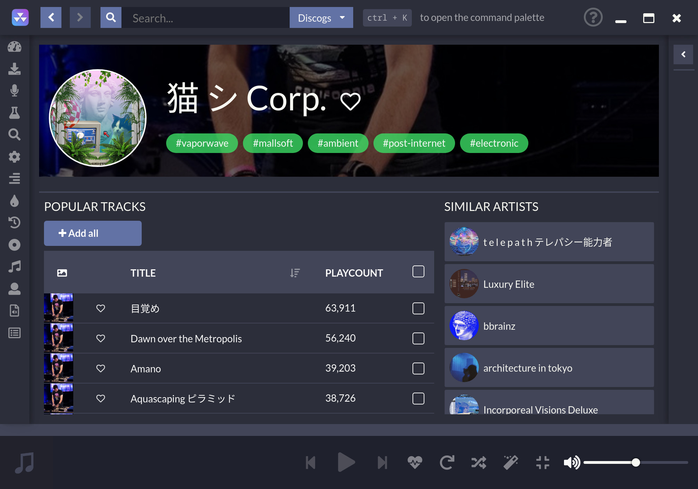

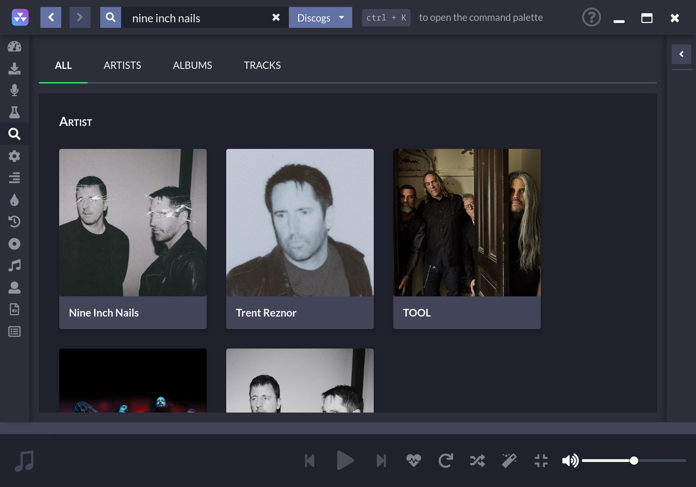

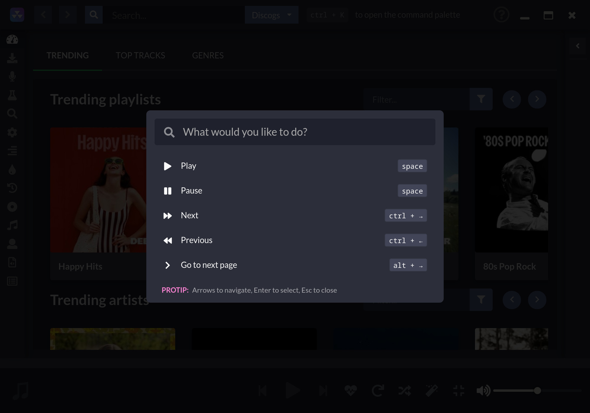

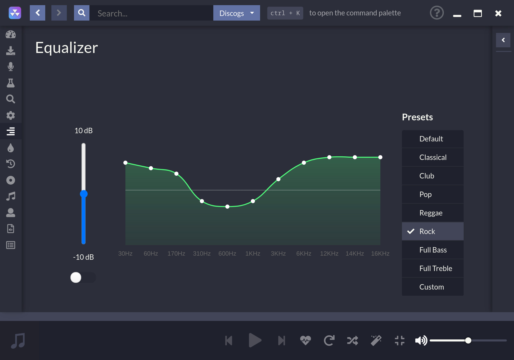

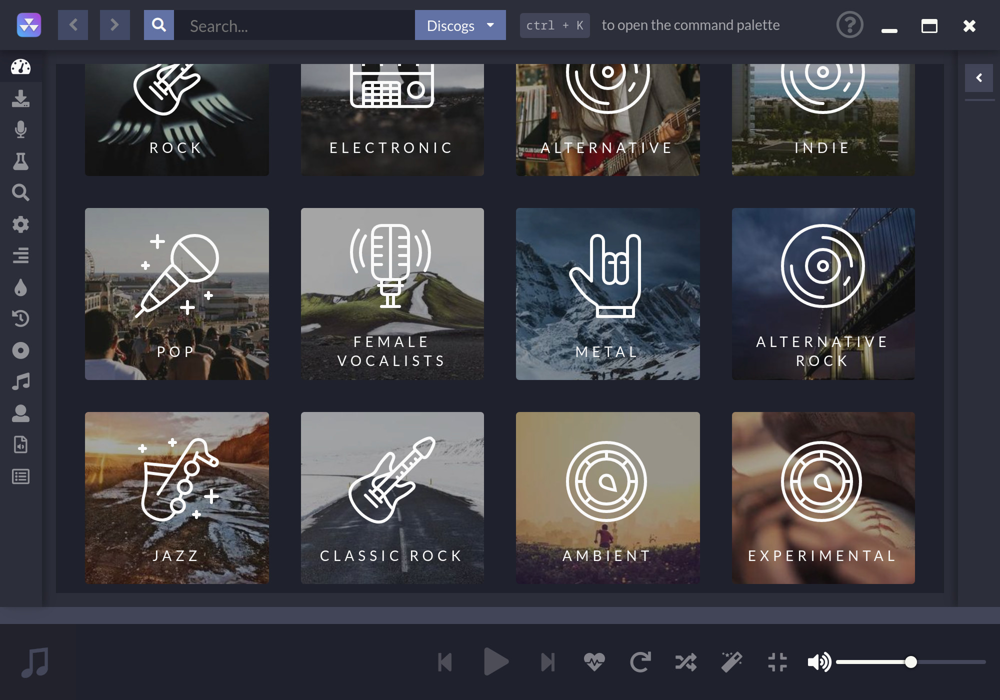

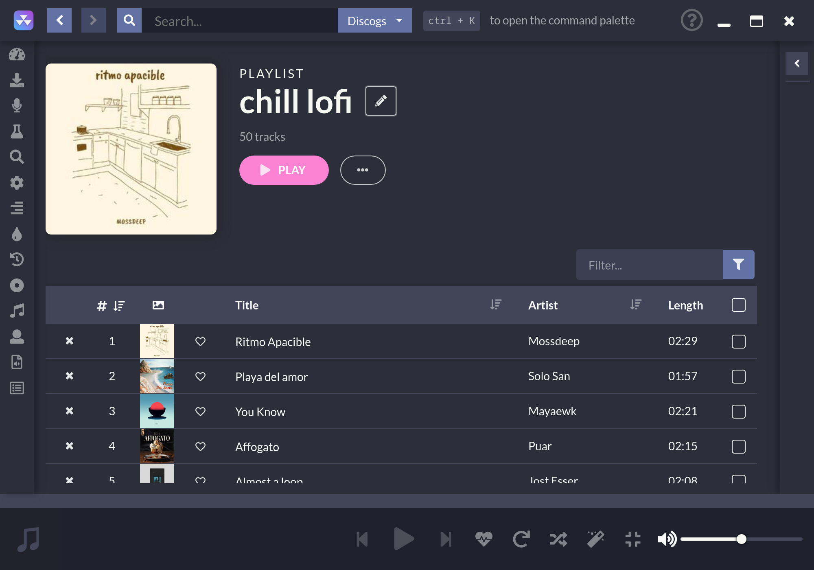

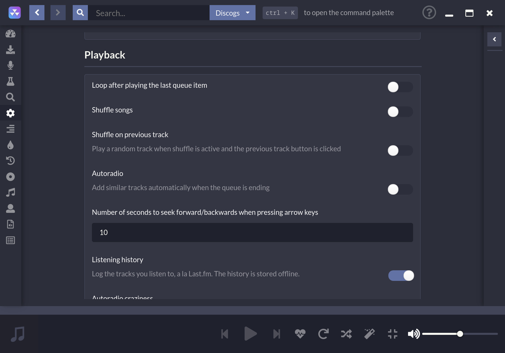

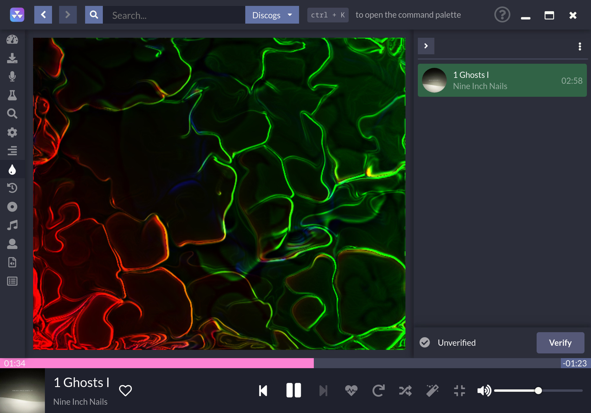

## Lizenz

Dieses Programm steht unter der Lizenz "Freie Software" das bedeutet, dass nicht nur die Sofzware kostenlos genutzt und weiterverbreitet werden darf, sondern auch der Urheber verpflichtet ist den Quellcode offenzulegen. Der Lizenznehmer darf diesen Quellcode dann nicht nur einsehen, sondern auch verändern und den geänderten Quellcode und die daraus resultierende Software weiterverbreiten.

