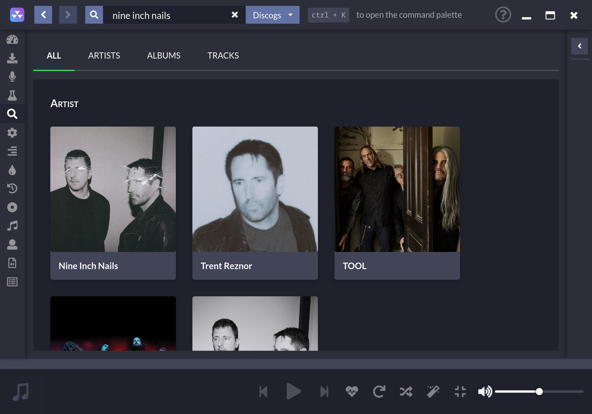
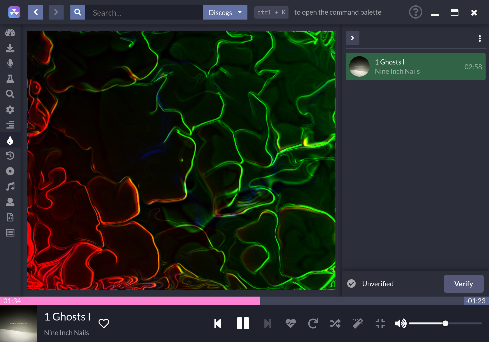

#  
[](https://snapcraft.io/nuclear) [](https://discord.gg/JqPjKxE)

Reproductor de música de escritorio centrado en la transmisión desde fuentes gratuitas


# Enlaces

[Sitio web oficial](https://nuclearplayer.com)

[Descargas](https://github.com/nukeop/nuclear/releases)

[Documentación](https://nukeop.gitbook.io/nuclear/)

[Mastodon](https://fosstodon.org/@nuclearplayer)

[Twitter](https://twitter.com/nuclear_player)

Canal de soporte (Matrix): `#nuclear:matrix.org`

Chat en Discord: https://discord.gg/JqPjKxE

Traducciones de la documentación: 

<kbd>[](docs/README-de.md)</kbd>
<kbd>[](docs/README-ptbr.md)</kbd>
<kbd>[](docs/README-se.md)</kbd>
<kbd>[](README.md)</kbd>
<kbd>[](docs/README-he.md)</kbd>
<kbd>[](docs/README-it.md)</kbd>
<kbd>[](docs/README-tr.md)</kbd>
<kbd>[](docs/README-id.md)</kbd>
<kbd>[](docs/README-fr.md)</kbd>

## ¿Qué es?
Nuclear es un programa gratuito de transmisión de música que extrae contenido de fuentes gratuitas en Internet.

Si conoces [mps-youtube](https://github.com/mps-youtube/mps-youtube), este es un reproductor de música similar pero con una interfase gráfica.
También se enfoca más en el audio. Imagina Spotify por el que no tienes que pagar y con una biblioteca más grande.

## ¿Qué pasa si soy religiosamente opuesto a Electron?
Mira [esto](docs/electron.md).

## Características

- Buscar y reproducir música de YouTube (incluida la integración con listas de reproducción y [SponsorBlock] (https://sponsor.ajay.app/)), Jamendo, Audius y SoundCloud
- Búsqueda de álbumes (con tecnología de Last.fm y Discogs), vista de álbumes, búsqueda automática de canciones según el artista y el nombre de la pista (en progreso, a veces puede ser poco fiable)
- Cola de canciones, que se puede exportar como una lista de reproducción
- Carga de listas de reproducción guardadas (almacenadas en archivos json)
- Scrobbling en last.fm (junto con la actualización del estado de 'reproducción en curso')
- Lanzamientos más recientes con reseñas: pistas y álbumes
- Navegación por género
- Modo de radio (pone automáticamente en cola pistas similares)
- Descargas ilimitadas (con tecnología de youtube)
- Letras en tiempo real
- Navegación por popularidad
- Lista de canciones favoritas
- Escuchar de la biblioteca local
- Sin cuentas
- Sin anuncios
- Sin Coc
- Sin CLA

## Manual y documentación
https://nuclearmusic.rtfd.io/

## Paquetes mantenidos por la comunidad

Aquí hay una lista de paquetes para varios administradores, algunos de los cuales son mantenidos por terceros. Nos gustaría agradecer a los mantenedores por su trabajo.

| Tipo de paquete   | Enlace                                                               | Mantenedor                                   | Instalación Método                           |
|:--------------:|:------------------------------------------------------------------:|:--------------------------------------------:|:---------------------------------------------:|
| AUR (Arch)     | https://aur.archlinux.org/packages/nuclear-player-bin/             | [nukeop](https://github.com/nukeop)          | yay -s nuclear-player-bin                     |
| AUR (Arch)     | https://aur.archlinux.org/packages/nuclear-player-git              | [nukeop](https://github.com/nukeop)          | yay -s nuclear-player-git                     |
| Choco (Win)    | https://chocolatey.org/packages/nuclear/                           | [JourneyOver](https://github.com/JourneyOver)| choco install nuclear                         |
| GURU (Gentoo)  | https://github.com/gentoo/guru/tree/master/media-sound/nuclear-bin | Orphaned    | emerge nuclear-bin                            |
| Homebrew (Mac) | https://formulae.brew.sh/cask/nuclear                              | Homebrew                                     | brew install --cask nuclear                   |
| Snap           | https://snapcraft.io/nuclear                                       | [nukeop](https://github.com/nukeop)          | sudo snap install nuclear                     |
| Flatpak        | https://flathub.org/apps/details/org.js.nuclear.Nuclear            | [nukeop](https://github.com/nukeop)          | flatpak install flathub org.js.nuclear.Nuclear|


## Traducciones comunitarias
Nuclear ya se ha traducido a varios idiomas y siempre estamos buscando colaboradores que deseen agregar más.

Estamos usando [Crowdin] (https://crowdin.com/project/nuclear) para administrar la localización. Puede verificar si su idioma es compatible, realizar un seguimiento del progreso de la localización y ayudarnos a traducir Nuclear allí.

| Idioma               | Contributor                                                                                                                      |
|:--------------------:|:--------------------------------------------------------------------------------------------------------------------------------:|
| Inglés               | N/A                                                                                                                              |
| Francés              | [charjac](https://github.com/charjac), [Zalax](https://github.com/Zalaxx)                                                        |
| Holandés             | [Vistaus](https://github.com/Vistaus)                                                                                            |
| Danés                | [Hansen1992](https://github.com/Hansen1992)                                                                                      |
| Español              | [mlucas94](https://github.com/mlucas94), [emlautarom1](https://github.com/emlautarom1), [amendezm](https://github.com/amendezm)  |
| Polaco               | [kazimierczak-robert](https://github.com/kazimierczak-robert), [gradzka](https://github.com/gradzka)                             |
| Alemán               | [schippas](https://github.com/schippas)                                                                                          |
| Ruso                 | [ramstore07](https://github.com/ramstore07), [dmtrshat](https://github.com/dmtrshat)                                             |
| Portugués            | [JoaoPedroMoraes](https://github.com/JoaoPedroMoraes)                                                                            |
| Turco                | [3DShark](https://github.com/3DShark)                                                                                            |
| Italiano             | [gello94](https://github.com/gello94), [scardracs](https://github.com/scardracs)                                                 |
| Eslovaco             | [MartinT](https://github.com/MartinTuroci)                                                                                       |
| Checo                | [PetrTodorov](https://github.com/PetrTodorov)                                                                                    |
| Tagalo               | [giftofgrub](https://github.com/giftofgrub)                                                                                      |
| Chino tradicional    | [oxygen-TW](https://github.com/oxygen-TW)                                                                                        |
| Sueco                | [PalleKarlsson](https://github.com/PalleKarlsson), [nonew-star](https://github.com/nonew-star)                                   |
| Griego               | [Shuin-San](https://github.com/Shuin-San)                                                                                        |

## Proceso de desarrollo

En primer lugar, asegúrese de consultar las [Guías de contribución] (https://nukeop.gitbook.io/nuclear/contributing/contribution-guidelines).

Usa npm:
```shell
$ npm install  # instalar dependecias
$ npm start
```

Debería abrirse una nueva ventana que cargará la aplicación web y ejecutará Nuclear.

---
Desarrollar en el sistema operativo actual:
```shell
$ lerna bootstrap
$ npm run build
```

En lugar de `build`, puede usar` build: all` para compilar para todos los sistemas operativos. Los binarios estarán en `packages / app / release`

---
También es posible ejecutar el entorno de desarrollo utilizando contenedores Docker, pero esto debe considerarse experimental.

Necesitará docker y docker-compose. Debe permitir que el usuario root se conecte a la pantalla X11, para que pueda ejecutar docker-compose:

```shell
$ xhost SI:localuser:root
$ sudo docker-compose up dev
```
A partir de ahora también puede crear una versión flatpak. Deberá instalar gobject-introspection y flatpak-builder. Después de eso, deberá instalar los tiempos de ejecución y las dependencias requeridas por flatpak-builder para el proceso de compilación. Necesitará la versión 19.08 de estos flatpaks.
```shell
$ flatpak install flathub org.freedesktop.Platform
$ flatpak install flathub org.freedesktop.Sdk
$ flatpak install flathub io.atom.electron.BaseApp
```
A continuación, para construir el proyecto (use la bandera `--verbose` para obtener más resultados):
```shell
$ flatpak-builder build-dir org.js.nuclear.Nuclear.json
```
Para ejecutar la aplicación construida:
```shell
$ flatpak-builder --run build-dir org.js.nuclear.Nuclear.json run.sh
```
Puede convertir la aplicación en un repositorio local. actualmente, el archivo crea la última versión.

## Capturas de pantalla







## Licencia

Este programa es software libre: puede redistribuirlo y / o modificarlo según los términos de la Licencia Pública General GNU Affero publicada por la Free Software Foundation, ya sea la versión 3 de la Licencia o (a su elección) cualquier versión posterior.
