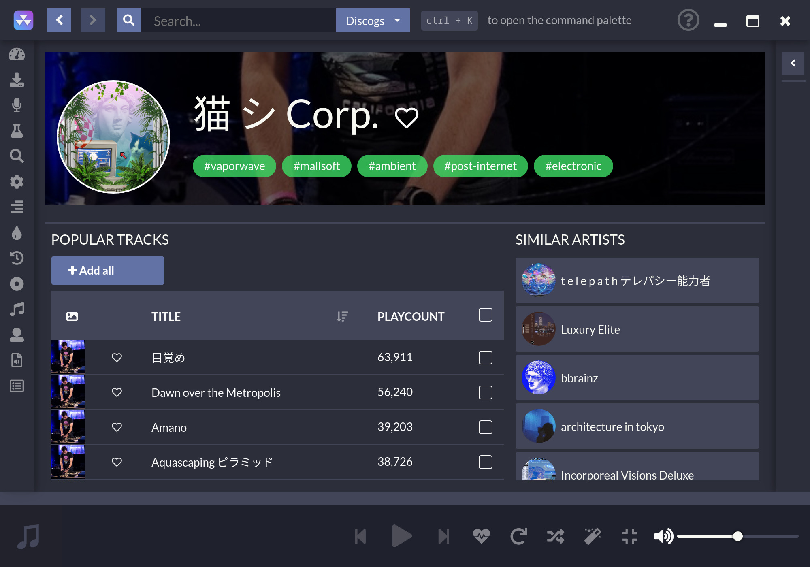

#  
[](https://codeclimate.com/github/nukeop/nuclear/maintainability) [](https://www.codacy.com/app/nukeop/nuclear?utm_source=github.com&amp;utm_medium=referral&amp;utm_content=nukeop/nuclear&amp;utm_campaign=Badge_Grade) [](https://snapcraft.io/nuclear) 

<div dir="rtl">
תוכנה להזרמת שירים מבוססת על מקורות חינמיים


# קישורים

[האתר הרשמי](https://nuclearplayer.com)

[Mastodon](https://fosstodon.org/@nuclearplayer)

[טוויטר](https://twitter.com/nuclear_player)

ערוץ תמיכה (Matrix): `#nuclear:matrix.org`

ערוץ הדיסקורד: https://discord.gg/JqPjKxE

תרגומים נוספים לדף:

<kbd>[](docs/README-de.md)</kbd>
<kbd>[](README-ptbr.md)</kbd>
<kbd>[](README-se.md)</kbd>
<kbd>[](../README.md)</kbd>
<kbd>[](README-he.md)</kbd>
<kbd>[](README-it.md)</kbd>
<kbd>[](docs/README-id.md)</kbd>
<kbd>[](docs/README-fr.md)</kbd>

## מה זה בכלל Nuclear?
Nuclear היא תוכנה חינמית להזרמת תכנים ממקורות חינמיים ברחבי האינטרנט.

מבינכם שמכירים את [mps-youtube](https://github.com/mps-youtube/mps-youtube), זו תוכנה דומה אך עם תוספת של ממשק משתמש גרפי. אנחנו מתמקדים בעיקר באודיו. דמיינו את ספוטיפיי אבל ללא תשלום ועם ספרייה גדולה יותר.

## אנחנו משתמשים בElectron, אם אתם נגד
קראו [כאן](electron.md).

## פיצ׳רים

- אפשרות לחיפוש ולשמוע שירים הישר מהאתר YouTube (כולל קישור עם פלייליסטים), Jamendo, Audius ו - SoundCloud
- אפשרות חיפוש לאלבומים (אשר מופעלים על ידי Last.fm ו - Discogs), חיפוש שירים על פי שם האמן ושם השיר (בתהליך, יכול להיות באגי לפעמים)
- אפשרות ליצירת תור שמיעת שירים, שגם יכולה לייצא כפלייליסט
- אפשרות טעינת פלייליסטים שמורים (שמורים כקובץ JSON)
- אפשרות לקשר את החשבון שלך בLast.fm (בנוסף גם מאפשר להצגת סטטוס ׳מושמע כרגע...׳)
- העדכונים הכי חדשים כולל ביקורת - שירים ואלבומים
- אפשרות חיפוש לפי סגנון מוזיקה
- אפשרות למצב רדיו (דומה לתור שירים אך עם שירים דומים למה שמושמע)
- אפשרות לאינסוף הורדות (מופעל על ידי YouTube)
- אפשרות לתצוגת מילות השירים בזמן אמת
- אפשרות חיפוש על פי פופולריות
- אפשרות יצירת רשימה של שירים מועדפים
- אפשרות שמיעה של תכנים מתוך המחשב
- אין צורך במשתמש
- אין שום פרסומות
- אין צורך בלחתום על שום דבר כדי לתרום לפרוייקט

## מידע למשתמש
https://nuclearmusic.rtfd.io/

## חבילות שנתמכות על ידי הקהילה

לפניכם רשימה של החבילות עבור מנהלי החבילות השונים, רובן מתוחזקות על ידי תומכי צד שלישי.

| סוג חבילה   |    קישור                                                    | נתמך על ידי                                    |
|:--------------:|:-------------------------------------------------------:|:---------------------------------------------:|
| AUR (Arch)     | https://aur.archlinux.org/packages/nuclear-player-bin/  | [advaithm](https://github.com/advaithm)       |
| AUR (Arch)     | https://aur.archlinux.org/packages/nuclear-player-git   | [advaithm](https://github.com/advaithm)       |
| Choco (Win)    | https://chocolatey.org/packages/nuclear/                | [JourneyOver](https://github.com/JourneyOver) |
| Homebrew (Mac) | https://formulae.brew.sh/cask/nuclear                   | Homebrew                                      |
| Snap           | https://snapcraft.io/nuclear                            | [nukeop](https://github.com/nukeop)           |
| Flatpak        | https://flathub.org/apps/details/org.js.nuclear.Nuclear  | [advaithm](https://github.com/advaithm)       |

תודה ענקית ל[ayyeve](https://github.com/ayyEve) על הרשות (advaithm) להשתמש בשרת שלה על מנת לקמפל את המכונה

## תרגומים על ידי הקהילה

Nuclear כבר תורגמה למספר שפות, ואנחנו כל הזמן מחפשים אחר תורמים אשר מוכנים להוסיף עוד. למטה ישנה רשימה של השפות הזמינות כרגע, יחד עם התורמים אשר עזרו לתרגם.

| שפה             | תורם                                                                                          |
|:--------------------:|:----------------------------------------------------------------------------------------------------:|
| English              | N/A                                                                                                  |
| French               | [charjac](https://github.com/charjac), [Zalax](https://github.com/Zalaxx)                            |
| Dutch                | [Vistaus](https://github.com/Vistaus)                                                                |
| Danish               | [Hansen1992](https://github.com/Hansen1992)                                                          |
| Spanish              | [mlucas94](https://github.com/mlucas94), [emlautarom1](https://github.com/emlautarom1)               |
| Polish               | [kazimierczak-robert](https://github.com/kazimierczak-robert), [gradzka](https://github.com/gradzka) |
| German               | [schippas](https://github.com/schippas)                                                              |
| Russian              | [ramstore07](https://github.com/ramstore07), [dmtrshat](https://github.com/dmtrshat)                 |
| Brazilian Portuguese | [JoaoPedroMoraes](https://github.com/JoaoPedroMoraes)                                                |
| Turkish              | [3DShark](https://github.com/3DShark)                                                                |
| Italian              | [gello94](https://github.com/gello94)                                                                |
| Slovak               | [MartinT](https://github.com/MartinTuroci)                                                           |
| Czech                | [PetrTodorov](https://github.com/PetrTodorov)                                                        |
| Tagalog              | [giftofgrub](https://github.com/giftofgrub)                                                          |
| Traditional Chinese  | [oxygen-TW](https://github.com/oxygen-TW)                                                            |
| Swedish              | [PalleKarlsson](https://github.com/PalleKarlsson), [nonew-star](https://github.com/nonew-star)                                                    |
| Greek                | [Shuin-San](https://github.com/Shuin-San)                                                            |
| Vietnamese           | [HaiDang666](https://github.com/HaiDang666)                                                          |
| Finnish              | [cjola002-xamk](https://github.com/cjola002-xamk)                                                    |

## תהליך פיתוח

ראשית כל, וודאו שקראתם את [עמוד הסבר על התרומות](https://github.com/nukeop/nuclear/wiki/Contributing).

השתמשו ב - npm:
<div dir="ltr">

```shell
$ npm install # installs dependencies
$ npm start
```
</div>

חלון חדש אמור להיפתח אשר יטען את את התוכנה.

---

כדי לבנות למערכת הפעלה הנוכחית שלך:
<div dir="ltr">

```shell
$ lerna bootstrap
$ npm run build
```
</div>

על מנת לבנות לכל מערכות ההפעלה החליפו את `build` עם `build:all`. הקבצים יהיו ב `packages/app/realease`

---

יש אפשרות גם להריץ סביבת פיתוח בעזרת Docker Containers, אבל זו אפשרות נסיונית.
אתם צריכים Docker ו - Docker - Compose. אתם תצטרכו לאפשר למשתמש הראשי להתחבר ל - X11 Display, ואז תוכלו להריץ Docker - Compose:
<div dir="ltr">

```shell
$ xhost SI:localuser:root
$ sudo docker-compose up dev
```
</div>

נכון לרגע זה, יש אפשרות גם לבנות גרסת flatpak. עליכם להתקין gobject-introspection, ו -  flatpak-builder. אחרי זה עליכם להתקין את הקבצים הדרושים בשביל תהליך הקימפול. אתם נדרשים לגרסת 19.08 ל - flatpaks האלה.
<div dir="ltr">

```shell
$ flatpak install flathub org.freedesktop.Platform
$ flatpak install flathub org.freedesktop.Sdk
$ flatpak install flathub io.atom.electron.BaseApp
```
</div>

כעת, על מנת לבנות את הפרוייקט (כתבו בנוסף את הפקודה  <span dir="ltr">`--verbose`</span> כדי לקבל פלט מפורט יותר):
<div dir="ltr">

```shell
$ flatpak-builder build-dir org.js.nuclear.Nuclear.json
```
</div>

כדי להריץ את התוכנה הבנויה:
<div dir="ltr">

```shell
$ flatpak-builder --run build-dir org.js.nuclear.Nuclear.json run.sh
```
</div>

## צילומי מסך

זה יתעדכן ככל שהתוכנה תתפתח





## רישיון

התוכנה הזו היא תוכנה חינמית: אתם יכולים להפיץ את זה מחדש ו/או לשנות את זה תחת תנאי רישיון ה GNU Affero General Public License כמופץ על ידי העמותה לתוכנה חינמית, או גרסה 3 של הרישיון, או (לפי בחירתך) כל גרסא אחרת.
