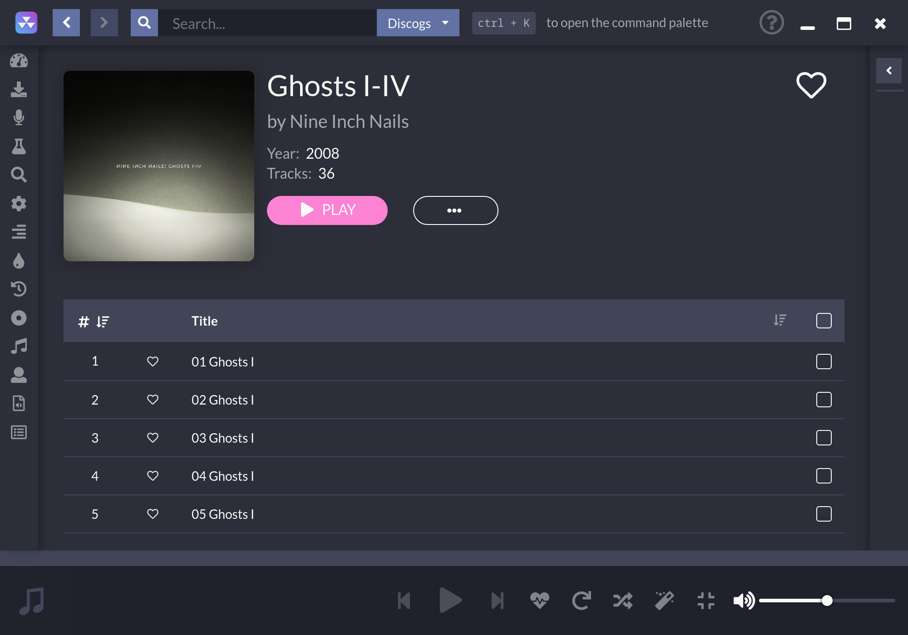

# 
 

डेस्कटॉप म्यूजिक प्लेयर मुफ्त स्रोतों से स्ट्रीमिंग पर केंद्रित है

# लिंक

[आधिकारिक वेबसाइट](https://nuclearplayer.com)

[डाउनलोड](https://github.com/nukeop/nuclear/releases)

[प्रलेखन](https://nukeop.gitbook.io/nuclear/)

[मेस्टोडोन](https://fosstodon.org/@nuclearplayer)

[ट्विटर](https://twitter.com/nuclear_player)

समर्थन चैनल (मैट्रिक्स): `#nuclear:matrix.org`

डिस्कोरड़ चैट: https://discord.gg/JqPjKxE

यहां नई सुविधाओं पर सुझाव दें और वोट करें: https://nuclear.featureupvote.com/

रीडमी अनुवाद:

<kbd></kbd>
<kbd></kbd>
<kbd></kbd>
<kbd></kbd>
<kbd></kbd>
<kbd></kbd>
<kbd></kbd>
<kbd></kbd>
<kbd></kbd>
<kbd></kbd>
<kbd></kbd>
<kbd></kbd>
<kbd></kbd>
<kbd></kbd>

## यह क्या है?
न्यूक्लियर एक मुफ्त संगीत स्ट्रीमिंग कार्यक्रम है जो पूरे इंटरनेट पर मुफ्त स्रोतों से सामग्री खींचता है।

यदि आप [mps-youtube](https://github.com/mps-youtube/mps-youtube) जानते हैं, यह एक समान म्यूजिक प्लेयर है लेकिन GUI के साथ है।
यह ऑडियो पर भी अधिक ध्यान केंद्रित कर रहा है। Spotify की कल्पना करें जिसके लिए आपको बड़ी लाइब्रेरी के साथ भुगतान नहीं करना है।

## क्या होगा यदि मैं इलेक्ट्रॉन का धार्मिक रूप से विरोध कर रहा हूँ?
[यह](docs/electron.md) देखो|

## विशेषताएँ

- YouTube से संगीत खोजना और चलाना (प्लेलिस्ट के साथ एकीकरण सहित और [प्रायोजक ब्लॉक](https://sponsor.ajay.app/)), जैमेंडो, ऑडियस और साउंडक्लाउड
- एल्बम खोज रहे हैं (Last.fm और Discogs द्वारा संचालित), एल्बम दृश्य, कलाकार और ट्रैक नाम के आधार पर स्वचालित गीत लुकअप (चालू, कभी-कभी पागल हो सकता है)
- गीत कतार, जिसे प्लेलिस्ट के रूप में निर्यात किया जा सकता है
- सहेजी गई प्लेलिस्ट लोड हो रही हैं (जेसन फाइलों में संग्रहीत)
- स्क्रोब्लिंग last.fm की और ('नाउ प्लेइंग' स्टेटस को अपडेट करने के साथ-साथ)
- समीक्षाओं के साथ नवीनतम रिलीज़ - ट्रैक और एल्बम
- शैली के अनुसार ब्राउज़ करना
- रेडियो मोड (स्वचालित रूप से समान ट्रैक को कतारबद्ध करें)
- असीमित डाउनलोड (YouTube द्वारा संचालित)
- रीयलटाइम गीत
- लोकप्रियता के पर ब्राउज़िंग
- पसंदीदा ट्रैक की सूची
- स्थानीय पुस्तकालय से सुनना
- कोई खाता नहीं
- कोई विज्ञापन नहीं
- कोई सीओसी नहीं
- कोई क्लास नहीं

## विकास की प्रक्रिया

सबसे पहले, जांचना [योगदान दिशानिर्देश](https://nukeop.gitbook.io/nuclear/contributing/contribution-guidelines) सुनिश्चित करें|

न्यूक्लियर को विकास मोड में चलाने के निर्देश [विकास की प्रक्रिया](https://nukeop.gitbook.io/nuclear/developer-resources/development-process) दस्तावेज़ में देखे जा सकते हैं।|

## समुदाय-रखरखाव पैकेज

यहां विभिन्न प्रबंधकों के लिए पैकेजों की सूची दी गई है, जिनमें से कुछ का मैन्टैन तृतीय पक्षों द्वारा किया जाता है। हम मैन्टेनर को उनके काम के लिए धन्यवाद देना चाहते हैं।

| बंडल का प्रकार   | संपर्क                                                               | मैन्टेनर                                   | इंस्टॉलेशन का तरीका                         |
|:--------------:|:------------------------------------------------------------------:|:--------------------------------------------:|:---------------------------------------------:|
| AUR (Arch)     | https://aur.archlinux.org/packages/nuclear-player-bin/             | [nukeop](https://github.com/nukeop)          | yay -s nuclear-player-bin                     |
| AUR (Arch)     | https://aur.archlinux.org/packages/nuclear-player-git              | [nukeop](https://github.com/nukeop)          | yay -s nuclear-player-git                     |
| Choco (Win)    | https://chocolatey.org/packages/nuclear/                           | [JourneyOver](https://github.com/JourneyOver)| choco install nuclear                         |
| GURU (Gentoo)  | https://github.com/gentoo/guru/tree/master/media-sound/nuclear-bin | Orphaned    | emerge nuclear-bin                            |
| Homebrew (Mac) | https://formulae.brew.sh/cask/nuclear                              | Homebrew                                     | brew install --cask nuclear                   |
| Snap           | https://snapcraft.io/nuclear                                       | [nukeop](https://github.com/nukeop)          | sudo snap install nuclear                     |
| Flatpak        | https://flathub.org/apps/details/org.js.nuclear.Nuclear            | [nukeop](https://github.com/nukeop)          | flatpak install flathub org.js.nuclear.Nuclear|
| Void Linux     | https://github.com/machadofguilherme/nuclear-template              | [machadofguilherme](https://github.com/machadofguilherme) | See readme

## सामुदायिक अनुवाद
न्यूक्लियर का पहले ही कई भाषाओं में अनुवाद किया जा चुका है, और हम हमेशा ऐसे योगदानकर्ताओं की तलाश में रहते हैं जो अधिक जोड़ना चाहते हैं।

हम [Crowdin](https://crowdin.com/project/nuclear) उपयोग कर रहे हैं स्थानीयकरण का प्रबंधन करने के लिए। आप जांच सकते हैं कि आपकी भाषा समर्थित है या नहीं, स्थानीयकरण प्रगति को ट्रैक करें, और वहां परमाणु का अनुवाद करने में हमारी सहायता करें।

## स्क्रीनशॉट

## लाइसेंस

यह प्रोग्राम मुफ्त सॉफ्टवेयर है: आप इसे फ्री सॉफ्टवेयर फाउंडेशन द्वारा प्रकाशित जीएनयू एफेरो जनरल पब्लिक लाइसेंस की शर्तों के तहत पुनर्वितरित और/या संशोधित कर सकते हैं, या तो संस्करण 3 का लाइसेंस, या (आपके विकल्प पर) किसी भी बाद के संस्करण में।

## विशेषताएं
प्रायोजकब्लॉक डेटा का उपयोग करता है जिसका उपयोग लाइसेंस के तहत किया जाता है [CC BY-NC-SA 4.0](https://creativecommons.org/licenses/by-nc-sa/4.0/) से https://sponsor.ajay.app/.
