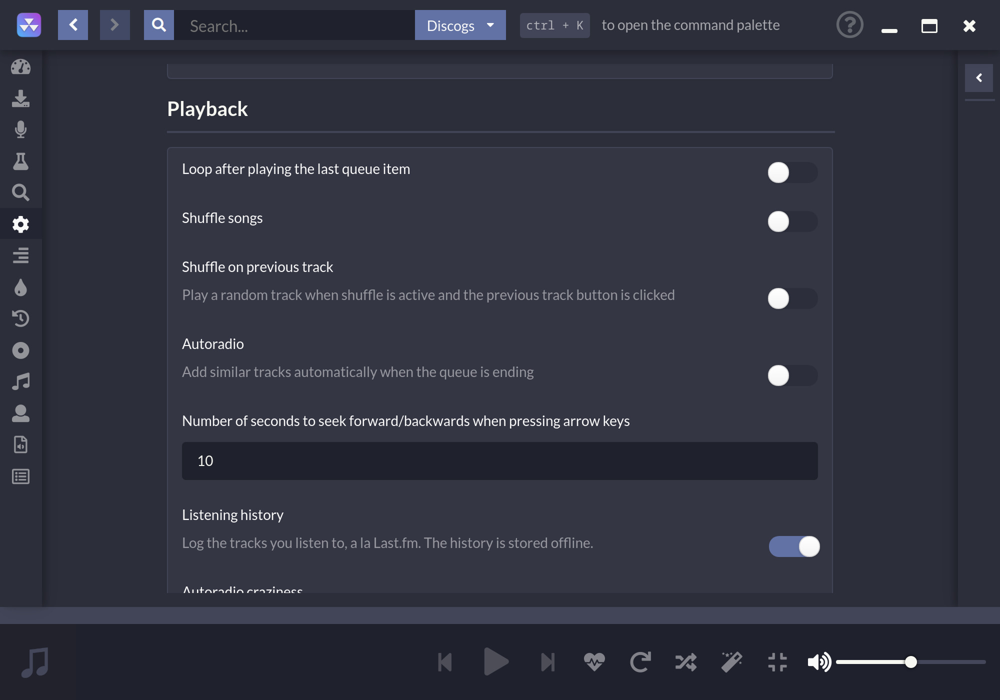

#  
 

無料の提供元からのストリーミングに特化したデスクトップ用音楽プレイヤー

# リンク

[公式サイト](https://nuclearplayer.com)

[ダウンロード](https://github.com/nukeop/nuclear/releases)

[解説文書](https://nukeop.gitbook.io/nuclear/)

[Mastodon](https://fosstodon.org/@nuclearplayer)

[Twitter](https://twitter.com/nuclear_player)

サポート用チャンネル (Matrix): `#nuclear:matrix.org`

Discord チャット: https://discord.gg/JqPjKxE

新機能の提案と投票はこちらへ: https://nuclear.featureupvote.com/

説明の翻訳:

<kbd></kbd>
<kbd></kbd>
<kbd></kbd>
<kbd></kbd>
<kbd></kbd>
<kbd></kbd>
<kbd></kbd>
<kbd></kbd>
<kbd></kbd>
<kbd></kbd>
<kbd></kbd>
<kbd></kbd>
<kbd></kbd>
<kbd></kbd>

## 何これ？　
nuclear は、インターネット上の無料の提供元からコンテンツを取得する、無料の音楽ストリーミングプログラムです。

[yewtube](https://github.com/mps-youtube/yewtube) (mps-youtube) をご存じであれば、似たような音楽プレイヤーですが、nuclear はGUIを備えています。また音声に特化しています。巨大なライブラリになった、無料の Spotify を想像してみてください。

## Electron の使用に反対している場合
[こちらを](electron-ja.md)ご覧ください。

## 機能

- YouTube（再生リストと [SponsorBlock](https://sponsor.ajay.app/) も統合）、Jamendo、Audius、SoundCloud を検索し音楽を再生
- アルバム（Last.fm と Discogs を利用）、アルバムの表示、アーティストと曲名から曲を自動探索（開発中で、時々調子が悪いです)
- 曲の再生キュー : 再生リストとしてエクスポートも可能
- 保存した再生リストの読み込み (json ファイルに保存)
- last.fm の Scrobbling（「再生中」のステータス更新と共に）
- レビュー付きの最新リリース - 曲とアルバム
- ジャンル別に探索
- ラジオモード（似た曲を再生キューに自動で追加）
- ダウンロード無制限 (youtube を利用)
- 歌詞を取得
- 人気順に探索
- 曲をお気に入りに登録
- 端末内のライブラリから視聴
- アカウント不要
- 広告なし
- 行動規約なし
- 使用許諾契約への同意なし

## 開発への参加

最初に [Contribution Guidelines](https://nukeop.gitbook.io/nuclear/contributing/contribution-guidelines)（貢献者のガイドライン）をご確認ください。

開発モードで Nuclear を実行する方法は、[Development Process](https://nukeop.gitbook.io/nuclear/developer-resources/development-process) の解説文書をご覧ください。

## コミュニティが管理するパッケージ

様々なパッケージ管理の一覧です。一部は第三者によって管理されています。保守管理に感謝します。

| パッケージ種別   | リンク                                                               | 保守担当者                                   | インストール方法                           |
|:--------------:|:------------------------------------------------------------------:|:--------------------------------------------:|:---------------------------------------------:|
| AUR (Arch)     | https://aur.archlinux.org/packages/nuclear-player-bin/             | [nukeop](https://github.com/nukeop)          | yay -s nuclear-player-bin                     |
| AUR (Arch)     | https://aur.archlinux.org/packages/nuclear-player-git              | [nukeop](https://github.com/nukeop)          | yay -s nuclear-player-git                     |
| Choco (Win)    | https://chocolatey.org/packages/nuclear/                           | [JourneyOver](https://github.com/JourneyOver)| choco install nuclear                         |
| GURU (Gentoo)  | https://github.com/gentoo/guru/tree/master/media-sound/nuclear-bin | Orphaned    | emerge nuclear-bin                            |
| Homebrew (Mac) | https://formulae.brew.sh/cask/nuclear                              | Homebrew                                     | brew install --cask nuclear                   |
| Snap           | https://snapcraft.io/nuclear                                       | [nukeop](https://github.com/nukeop)          | sudo snap install nuclear                     |
| Flatpak        | https://flathub.org/apps/details/org.js.nuclear.Nuclear            | [nukeop](https://github.com/nukeop)          | flatpak install flathub org.js.nuclear.Nuclear|
| Void Linux     | https://github.com/machadofguilherme/nuclear-template              | [machadofguilherme](https://github.com/machadofguilherme) | See readme

## コミュニティによる翻訳
Nuclear は、既に多くの言語に翻訳されており、また追加したいと望む貢献者を求めています。

[Crowdin](https://crowdin.com/project/nuclear) で翻訳を管理しています。あなたの言語が対応するかを確認し、翻訳状況を追跡して、Nuclear の翻訳に協力してください。

## スクリーンショット

## ライセンス

本プログラムは、自由ソフトウェアです: フリーソフトウェア財団が発行する、GNU Affero 一般公衆ライセンスのバージョン3、または（あなたの選択により）それ以降の条件に基づいて、再配布や修正が可能です。

## 帰属
使用される SponsorBlock のデータは、[CC BY-NC-SA 4.0](https://creativecommons.org/licenses/by-nc-sa/4.0/)のライセンスで、以下のから提供されています。https://sponsor.ajay.app/