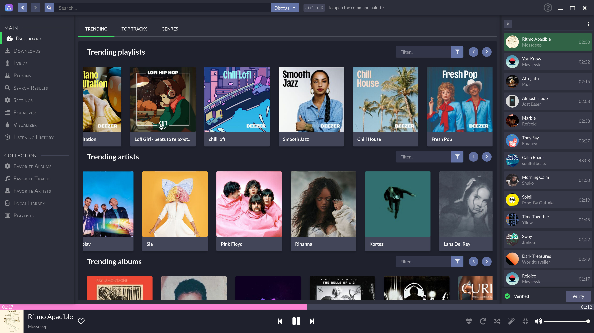
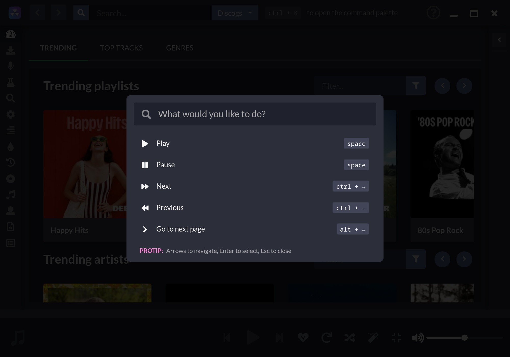
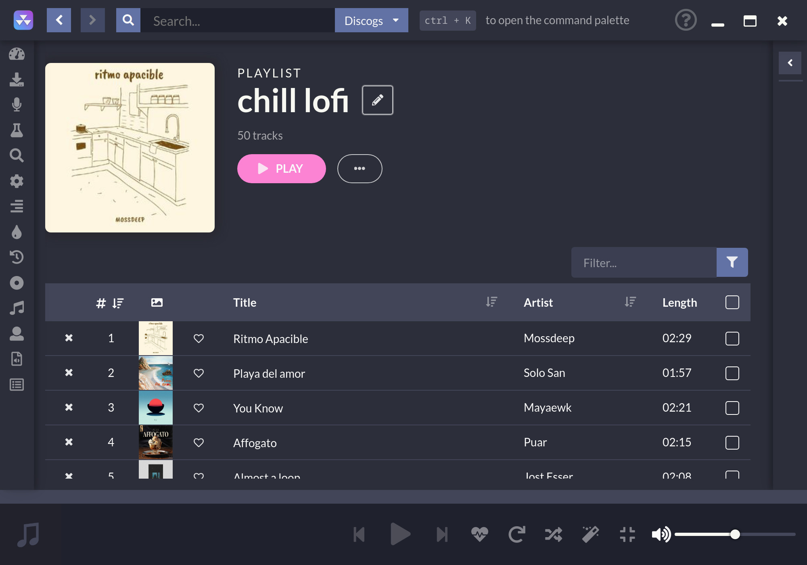

# 
 

Десктопный музыкальный проигрыватель, ориентированный на потоковую передачу из бесплатных источников

# Ссылки

[Официальный сайт](https://nuclearplayer.com)

[Скачать](https://github.com/nukeop/nuclear/releases)

[Документация](https://nukeop.gitbook.io/nuclear/)

[Mastodon](https://fosstodon.org/@nuclearplayer)

[Twitter](https://twitter.com/nuclear_player)

Канал поддержки (Matrix): `#nuclear:matrix.org`

Discord чат: https://discord.gg/JqPjKxE

Предлагайте и голосуйте за новые функции здесь: https://nuclear.featureupvote.com/

Переводы документации:

<kbd></kbd>
<kbd></kbd>
<kbd></kbd>
<kbd></kbd>
<kbd></kbd>
<kbd></kbd>
<kbd></kbd>
<kbd></kbd>
<kbd></kbd>
<kbd></kbd>
<kbd></kbd>
<kbd></kbd>
<kbd></kbd>

## Что это?
Nuclear - это бесплатная программа для потоковой передачи музыки, которая извлекает контент из бесплатных источников по всему Интернету.

Если вы знакомы с [mps-youtube](https://github.com/mps-youtube/mps-youtube), то это похожий музыкальный проигрыватель, но с графическим интерфейсом.
Он также больше специализируется на аудио. Представьте себе Spotify с большой библиотекой за который не нужно платить.

## Что если мне не нравится Electron?
Посмотрите [здесь](docs/electron-ru.md).

## Особенности

- Поиск и воспроизведение музыки с YouTube (включая интеграцию с плейлистами, а также [Sponsor Block](https://sponsor.ajay.app/), Jamendo, Audius и SoundCloud)
- Функция поиска альбомов (на основе Last.fm и Discogs), просмотра альбомов, автоматического поиска песен по исполнителю и названию трека (в разработке, иногда может не работать)
- Очередность песен, можно экспортировать в виде плейлиста
- Загружать сохраненные плейлисты (хранятся в файлах формата json)
- Синхронизация с last.fm (также обновляет статус «Исполняется»)
- Новейшие релизы с обзорами - треки и альбомы
- Поиск по жанрам
- Режим радио (автоматически подбирает похожие треки)
- Неограниченное количество загрузок (на основе YouTube)
- Отображение текстов песен в реальном времени
- Поиск по популярности
- Список любимых треков
- Прослушивание песен из локальной библиотеки
- Нет необходимости в аккаунте
- Без рекламы
- Без CoC (Кодекса поведения)
- Без CLA (Лицензионного соглашения с пользователем)

## Процесс разработки

Во-первых, убедитесь что вы прочли [Contribution Guidelines](https://nukeop.gitbook.io/nuclear/contributing/contribution-guidelines).

Инструкцию по запуску Nuclear в режиме разработки можно найти в документации [Development Process](https://nukeop.gitbook.io/nuclear/developer-resources/development-process).

## Пакеты, поддерживаемые сообществом

Ниже приведен список пакетов, используемых в различных менеджерах пакетов, некоторые из которых поддерживаются сторонними мейнтейнерами и имеют открытый исходный код.
Мы бы хотели искренне поблагодарить их за вклад в развитие.

|   Тип пакета   |                               Ссылка                               |                        Мейнтейнер                         |                Метод установки                 |
|:--------------:|:------------------------------------------------------------------:|:---------------------------------------------------------:|:----------------------------------------------:|
|   AUR (Arch)   |       https://aur.archlinux.org/packages/nuclear-player-bin/       |            [nukeop](https://github.com/nukeop)            |           yay -s nuclear-player-bin            |
|   AUR (Arch)   |       https://aur.archlinux.org/packages/nuclear-player-git        |            [nukeop](https://github.com/nukeop)            |           yay -s nuclear-player-git            |
|  Choco (Win)   |              https://chocolatey.org/packages/nuclear/              |       [JourneyOver](https://github.com/JourneyOver)       |             choco install nuclear              |
| GURU (Gentoo)  | https://github.com/gentoo/guru/tree/master/media-sound/nuclear-bin |                         Orphaned                          |               emerge nuclear-bin               |
| Homebrew (Mac) |               https://formulae.brew.sh/cask/nuclear                |                         Homebrew                          |          brew install --cask nuclear           |
|      Snap      |                    https://snapcraft.io/nuclear                    |            [nukeop](https://github.com/nukeop)            |           sudo snap install nuclear            |
|    Flatpak     |      https://flathub.org/apps/details/org.js.nuclear.Nuclear       |            [nukeop](https://github.com/nukeop)            | flatpak install flathub org.js.nuclear.Nuclear |
|   Void Linux   |       https://github.com/machadofguilherme/nuclear-template        | [machadofguilherme](https://github.com/machadofguilherme) |                   See readme                   

## Переводы от сообщества
Документация Nuclear и само приложение уже было переведено на некоторые языки, однако, мы всегда ищем людей готовых внести свой вклад и помочь нам с переводом.

Мы используем [Crowdin](https://crowdin.com/project/nuclear) для управления локализацией. Используя его, вы сможете проверить, поддерживается ли ваш язык, отслеживать прогресс локализации и сможете помогать нам переводить Nuclear на другие языки.

## Скриншоты

## Лицензия

Эта программа является свободным программным обеспечением: вы можете распространять ее и / или изменять в соответствии с условиями GNU Affero General Public License, опубликованной Фондом свободного программного обеспечения, либо версией 3 Лицензии, либо (по вашему выбору) любой более поздней версии.

## Атрибуты
Использование данных SponsorBlock лицензировано в соответствии с [CC BY-NC-SA 4.0](https://creativecommons.org/licenses/by-nc-sa/4.0/) на https://sponsor.ajay.app/.