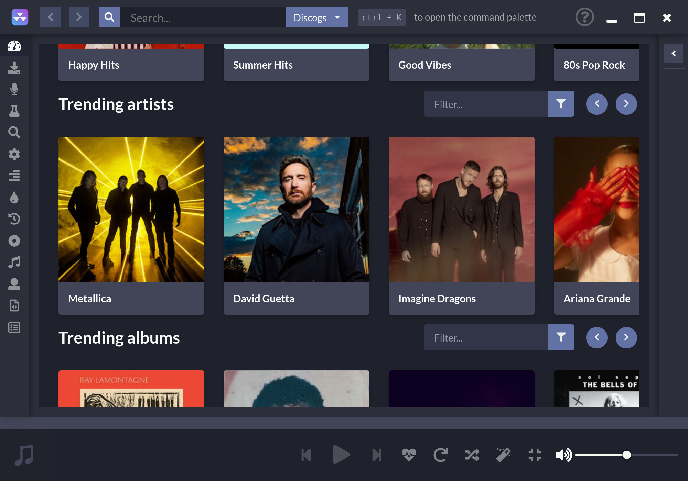
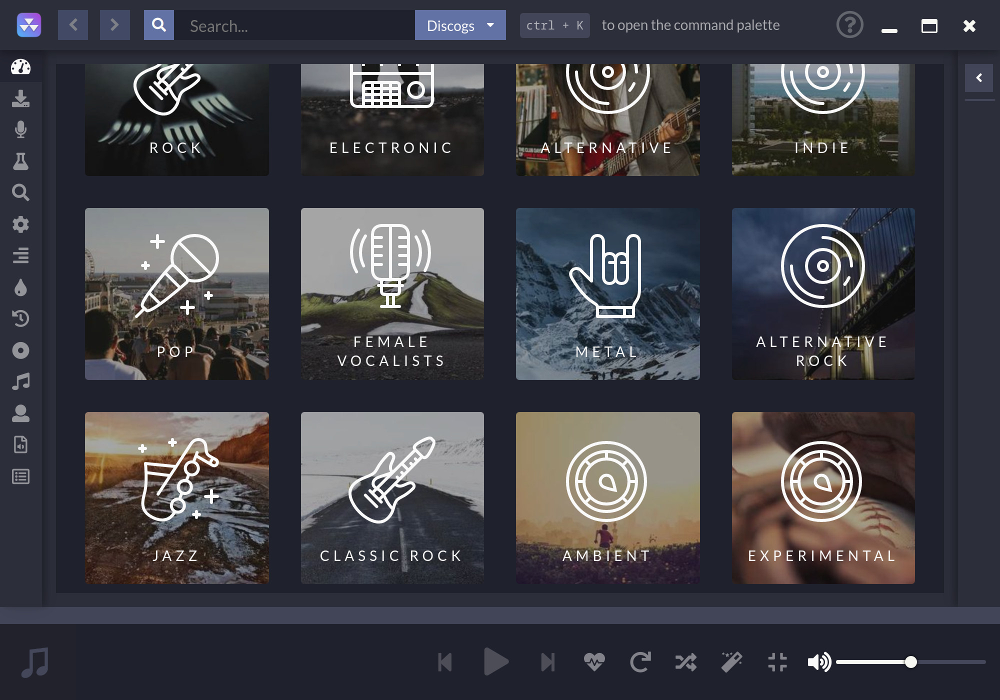

# 

 

Ücretsiz kaynaklardan yayına odaklanan masaüstü müzik çalar

# Bağlantılar

[Resmi Site](https://nuclearplayer.com)

[İndirmeler](https://github.com/nukeop/nuclear/releases)

[Dokümantasyon](https://nukeop.gitbook.io/nuclear/)

[Mastodon](https://fosstodon.org/@nuclearplayer)

[Twitter](https://twitter.com/nuclear_player)

Destek kanalı (Matrix): `#nuclear:matrix.org`

Discord sohbeti: https://discord.gg/JqPjKxE

Readme (beni oku) çevirileri:

<kbd></kbd>
<kbd></kbd>
<kbd></kbd>
<kbd></kbd>
<kbd></kbd>
<kbd></kbd>
<kbd></kbd>
<kbd></kbd>
<kbd></kbd>
<kbd></kbd>

## Bu Nedir?

nuclear, tüm internet üzerinden ücretsiz kaynaklardan içerik çeken ücretsiz bir müzik yayını programıdır.

Eğer [mps-youtube](https://github.com/mps-youtube/mps-youtube)'u biliyorsanız, bu da benzeri bir müzik çalar fakat GUI'ye sahip.
Ayrıca sese daha fazla odaklanıyor. Parasını ödemek zorunda olmadığınız ve daha büyük bir kütüphaneye sahip bir Spotify hayal edin.

## Eğer Electron'a Dini Olarak Karşıysam?

[Buna](docs/electron.md) bakın.

## Özellikler

- YouTube (oynatma listesi ve [SponsorBlock](https://sponsor.ajay.app/) entegrasyonu dahil), Jamendo, Audius and SoundCloud'dan müzik arama ve çalma.
- Albüm arama (Last.fm ve Discogs tarafından desteklenmektedir), albüm görünümü, sanatçı ve parça adına göre otomatik şarkı arama (hâlâ geliştirilmekte, bazen tehlikeli olabilir)
- Bir çalma listesi olarak dışa aktarılabilen şarkı kuyruğu
- Kaydedilmiş çalma listelerini yükleme (json dosyalarında saklanır)
- Last.fm'e skroplama ('şimdi oynatılıyor' durumunun güncellenmesiyle birlikte)
- İncelemeleri olan en yeni sürümler - parçalar ve albümler
- Türe göre tarama
- Radyo modu (benzer parçaları otomatik olarak sıraya koyma)
- Sınırsız indirme (YouTube tarafından desteklenmektedir)
- Gerçek zamanlı şarkı sözleri
- Popülerliğe göre arama
- Favori parçaların listesi
- Yerel kütüphaneden dinleme
- Hesap yok
- Reklam yok
- CoC yok
- CLA yok

## Geliştirme süreci

Her şeyden önce, [Katkıda Bulunma Yönergeleri](https://nukeop.gitbook.io/nuclear/contributing/contribution-guidelines)ni kontrol ettiğinizden emin olun.

Nuclear'ı geliştirme modunda çalıştırma talimatları [Geliştirme Süreci](https://nukeop.gitbook.io/nuclear/developer-resources/development-process) belgesinde bulunabilir.

## Topluluk tarafından sağlanan paketler

Aşağıda, bazıları üçüncü taraflarca sağlanan çeşitli yöneticilere yönelik paketlerin bir listesi bulunmaktadır. Geliştirenlere çalışmalarından dolayı teşekkür ederiz.

|   Paket tipi   |                              Bağlantı                              |                        Geliştirici                        |                Yükleme Yöntemi                 |
| :------------: | :----------------------------------------------------------------: | :-------------------------------------------------------: | :--------------------------------------------: |
|   AUR (Arch)   |       https://aur.archlinux.org/packages/nuclear-player-bin/       |            [nukeop](https://github.com/nukeop)            |           yay -s nuclear-player-bin            |
|   AUR (Arch)   |       https://aur.archlinux.org/packages/nuclear-player-git        |            [nukeop](https://github.com/nukeop)            |           yay -s nuclear-player-git            |
|  Choco (Win)   |              https://chocolatey.org/packages/nuclear/              |       [JourneyOver](https://github.com/JourneyOver)       |             choco install nuclear              |
| GURU (Gentoo)  | https://github.com/gentoo/guru/tree/master/media-sound/nuclear-bin |                         Orphaned                          |               emerge nuclear-bin               |
| Homebrew (Mac) |               https://formulae.brew.sh/cask/nuclear                |                         Homebrew                          |          brew install --cask nuclear           |
|      Snap      |                    https://snapcraft.io/nuclear                    |            [nukeop](https://github.com/nukeop)            |           sudo snap install nuclear            |
|    Flatpak     |      https://flathub.org/apps/details/org.js.nuclear.Nuclear       |            [nukeop](https://github.com/nukeop)            | flatpak install flathub org.js.nuclear.Nuclear |
|   Void Linux   |       https://github.com/machadofguilherme/nuclear-template        | [machadofguilherme](https://github.com/machadofguilherme) |                   See readme                   |

## Topluluk çevirileri

Nuclear zaten birçok dile çevrildi ve her zaman daha fazlasını eklemek isteyen katkıcı arıyoruz.

Yerelleştirmeyi yönetmek için [Crowdin](https://crowdin.com/project/nuclear) kullanıyoruz. Dilinizin desteklenip desteklenmediğini kontrol edebilir, yerelleştirme ilerlemesini takip edebilir ve Nuclear'ı çevirmemize yardımcı olabilirsiniz.

## Ekran Fotoğrafları

## Lisans

Bu program özgür bir yazılımdır: Özgür Yazılım Vakfı tarafından yayınlanan GNU Affero Genel Kamu Lisansı, Lisansın 3. sürümü veya (sizin tercihinize bağlı olarak) herhangi bir sonraki sürümü koşulları altında yeniden dağıtabilir ve/veya değiştirebilirsiniz.

## Atıflar

https://sponsor.ajay.app/ adresinden [CC BY-NC-SA 4.0](https://creativecommons.org/licenses/by-nc-sa/4.0/) kapsamında kullanılan SponsorBlock verilerini kullanır.
