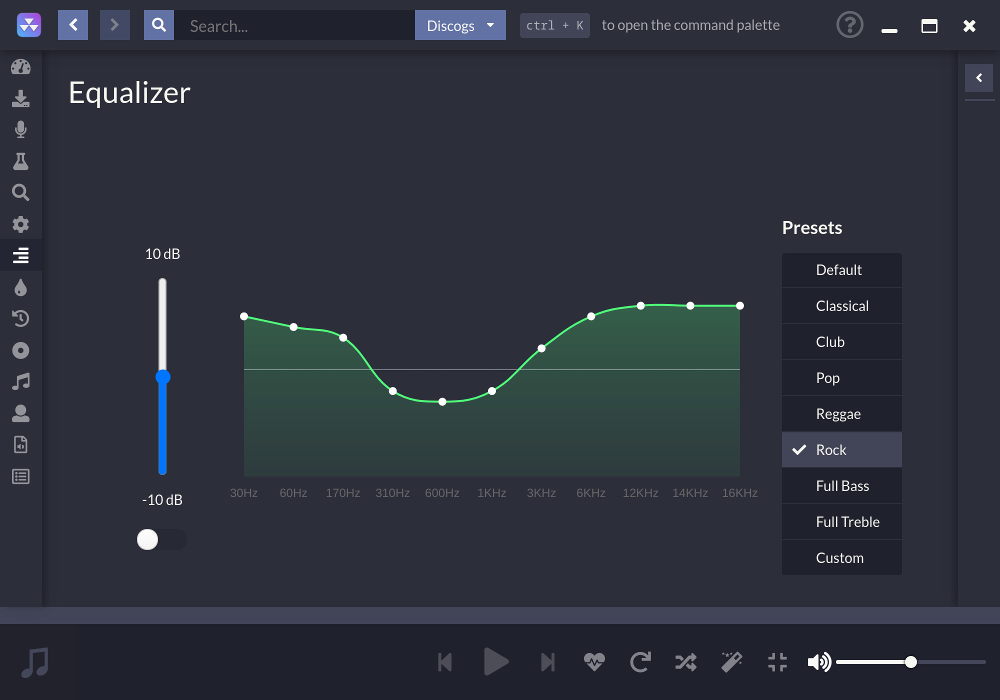

#  
 

一款专注于免费流媒体资源的桌面音乐播放器

# 相关链接

[官方网站](https://nuclearplayer.com)

[下载链接](https://github.com/nukeop/nuclear/releases)

[英文文档](https://nukeop.gitbook.io/nuclear/)

[Mastodon](https://fosstodon.org/@nuclearplayer)

[Twitter](https://twitter.com/nuclear_player)

官方Matrix频道 : `#nuclear:matrix.org`

Discord聊天室: https://discord.gg/JqPjKxE

在此对新功能提出建议和投票: https://nuclear.featureupvote.com/

Readme 翻译快捷跳转: 

<kbd></kbd>
<kbd></kbd>
<kbd></kbd>
<kbd></kbd>
<kbd></kbd>
<kbd></kbd>
<kbd></kbd>
<kbd></kbd>
<kbd></kbd>
<kbd></kbd>

## nuclear是什么？
nuclear是一个从互联网的各个角落拉取免费的资源的免费流媒体播放器。

如果你知道 [mps-youtube](https://github.com/mps-youtube/mps-youtube) 这个项目,该项目与之类似，但是我们提供了一个美观、强大的图形用户界面。nuclear更加的专注于音频。想象一下Spotify，你无须为音乐付费，而且你比Spotify有更多的音库来源的选择。

## 如果我实在觉得electron很膈应，该怎么办？
请看这里 [点击查看](./electron.md).

## 功能速览

- 搜索和播放YouTube上的音乐功能 (包括整合的播放列表和 [SponsorBlock](https://sponsor.ajay.app/))、Jamendo、Audius和SoundCloud。
- 专辑搜索功能 (由Last.fm和Discogs提供支持)，查看专辑, 基于艺术家和曲目名称的自动歌曲查询 (正在施工中，有时候可能会不太奏效)。
- 歌曲队列，可以作为播放列表导出。
- 加载保存的播放列表 (储存在json格式文件中)。
- 同步至last.fm(同时更新"正在播放"的状态)。
- 带评论的最新出版歌曲 - 专辑和音轨。
- 按照音乐流派浏览。
- 音乐电台模式 (自动排查类似的曲目)。
- 无限制的下载 (基于youtube提供的服务)。
- 实时歌词展示。
- 按照流行度浏览。
- 将喜欢的歌曲添加到你的喜爱曲目列表中。
- 在本地库文件中听歌。
- 无须注册账号。
- 没有任何广告。
- 没有行为准则约束。
- 没有贡献者许可协议。

## 开发进度

首先,一定要先看这个指导大纲：[Contribution Guidelines](https://nukeop.gitbook.io/nuclear/contributing/contribution-guidelines).

在开发模式下运行Nuclear的说明可以在一下的文档中找到： [Development Process](https://nukeop.gitbook.io/nuclear/developer-resources/development-process) 文档。

## 一些由开源社区维护的包

下面是一个用于各种包管理器的软件包列表，其中一些是由第三方维护的。真诚的感谢这些维护人员的辛勤工作，虎年大吉呀。

| 包管理器类型   | 链接                                                               | 维护者                                   | 安装方法                           |
|:--------------:|:------------------------------------------------------------------:|:--------------------------------------------:|:---------------------------------------------:|
| AUR (Arch)     | https://aur.archlinux.org/packages/nuclear-player-bin/             | [nukeop](https://github.com/nukeop)          | yay -s nuclear-player-bin                     |
| AUR (Arch)     | https://aur.archlinux.org/packages/nuclear-player-git              | [nukeop](https://github.com/nukeop)          | yay -s nuclear-player-git                     |
| Choco (Win)    | https://chocolatey.org/packages/nuclear/                           | [JourneyOver](https://github.com/JourneyOver)| choco install nuclear                         |
| GURU (Gentoo)  | https://github.com/gentoo/guru/tree/master/media-sound/nuclear-bin | Orphaned    | emerge nuclear-bin                            |
| Homebrew (Mac) | https://formulae.brew.sh/cask/nuclear                              | Homebrew                                     | brew install --cask nuclear                   |
| Snap           | https://snapcraft.io/nuclear                                       | [nukeop](https://github.com/nukeop)          | sudo snap install nuclear                     |
| Flatpak        | https://flathub.org/apps/details/org.js.nuclear.Nuclear            | [nukeop](https://github.com/nukeop)          | flatpak install flathub org.js.nuclear.Nuclear|
| Void Linux     | https://github.com/machadofguilherme/nuclear-template              | [machadofguilherme](https://github.com/machadofguilherme) | See readme

## 社区翻译
Nuclear的文档已经被翻译成好几种语言了，并且我们一直在寻找愿意贡献一份不一样的，更加优秀的翻译。

我们使用 [Crowdin](https://crowdin.com/project/nuclear) 来管理程序的本地化。你可以通过这个网站来看你所使用的语言是否被支持，并且跟踪该项目的本地化进展，帮助我们翻译Nuclear。

## 屏幕截图

## 开源许可证

该程序是完全免费的:  您可以根据自由软件基金会发布的GNU Affero通用公共许可证的条款，即许可证的第3版或（你自己的选择）任何后来的版本，重新发布或者也可以修改它。

## 贡献
在 [CC BY-NC-SA 4.0](https://creativecommons.org/licenses/by-nc-sa/4.0/) 许可证的授权下使用 SponsorBlock的数据，来自： https://sponsor.ajay.app/ 。
