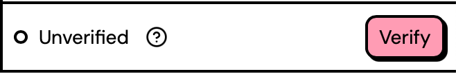
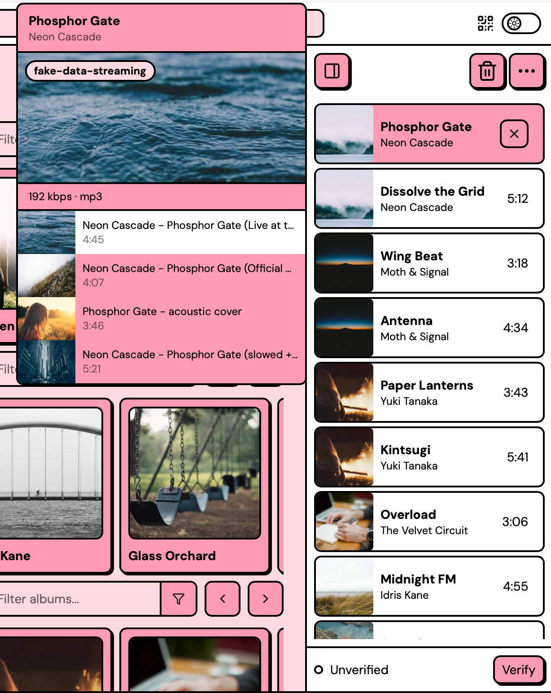
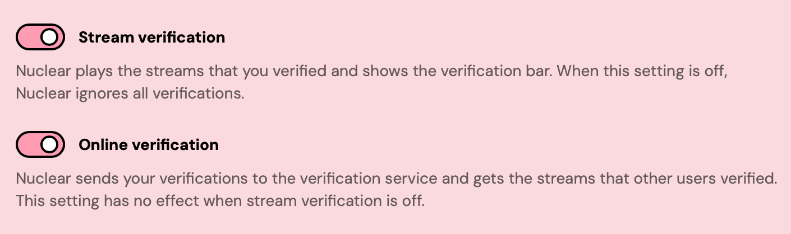

# Stream verification


Nuclear may sometimes play the wrong version of a song. To fix it, right-click the queue item and pick the right stream, then click **Verify**. Nuclear saves your verification on your computer and always plays that stream for the track.

If **Online verification** is on, Nuclear also shares your verification with other users, so they get that stream first. For each track you didn't verify, Nuclear asks the verification service for the stream with the most votes. It sends the artist, the title, and a random ID.


When you play a track, the streaming source searches for matching audio and picks the top result. That stream isn't always right: sometimes it's a live version, a cover, a remix, or a different track with a similar name. Stream verification lets you mark the right stream for a track. Nuclear saves your verification on your computer. If **Online verification** is on, Nuclear also shares your verification with other Nuclear users.

## How Nuclear uses verifications

Before Nuclear plays a track, it looks for a stream in this order and plays the first one it finds:

1. The stream that you verified locally.
2. The stream that you verified on the verification service. Nuclear gets this stream only if **Online verification** is on.
3. The stream with the most votes from other users. Nuclear gets this stream only if **Online verification** is on.
4. The first search result from your streaming source.

Nuclear keeps a different set of verifications for each streaming source. A stream that you verified for one source has no effect when you use a different source.

## The verification bar

The bar at the bottom of the queue panel shows the verification status of the stream that's playing now.

<figure><figcaption>
The verification bar under the queue
</figcaption></figure>

The status is one of these:

- **Unverified**: nobody verified the playing stream, or a different stream is verified for this track. It has 0 votes.
- **Weakly verified**: a few users verified this stream. It has 1 or 2 votes.
- **Verified**: many users verified this stream. It has 3 or more votes.
- **Verified by you**: you verified this stream.

When **Online verification** is off, Nuclear doesn't get votes. The status is then **Unverified** or **Verified by you**.

While Nuclear looks up the status, the status and the button show placeholders.

To see a short explanation of stream verification, click the question mark next to the status.

## Verify a stream

If the playing stream is the right one, click **Verify**. The status changes to **Verified by you**. Nuclear saves your verification on your computer and always plays that stream for the track. If **Online verification** is on, Nuclear also sends your vote to the verification service. Your vote helps other users get the same stream.

If Nuclear can't reach the verification service, Nuclear saves your verification only on your computer and shows a warning.

If the wrong stream is playing, see [Correct the wrong stream](#correct-the-wrong-stream).

To undo your verification, click **Unverify**. Nuclear removes your verification from your computer. If **Online verification** is on, Nuclear also removes your vote from the verification service.

If Nuclear can't reach the verification service, the service keeps your vote. Nuclear then continues to play that stream, and the status shows **Verified by you** again.

You have one verification per track. If you verify a different stream for the same track later, your verification moves to the new stream.


The **Verify** button is disabled until the stream loads.


## Correct the wrong stream

If the wrong stream is playing:

1. To open the stream candidates, right-click the track in the queue.
2. Click the correct candidate. Nuclear switches to it.
3. Click **Verify** in the verification bar.

<figure><figcaption>
Switching to a different candidate before verifying it
</figcaption></figure>

For more information about stream candidates, see [Stream candidates](the-queue.md#stream-candidates).

## Privacy

While **Online verification** is on, Nuclear contacts the verification service for each track that you play and didn't verify locally. If you don't want that, [turn off Online verification](#turn-off-stream-verification). Then your verifications stay on your computer, and Nuclear sends nothing.

Verification doesn't need an account. The first time Nuclear connects to the verification service, it creates a random ID and saves it in your settings. This ID is the only thing that connects your verifications to each other.

For each of these tracks, Nuclear sends only the track's artist and title, which streaming source you use, and your random ID. When you click **Verify** or **Unverify**, Nuclear also sends the stream's ID.

Like any server you connect to, the verification service can see your IP address.

## Turn off stream verification

Open **Settings**. Go to **Playback**. Two settings control stream verification:

- **Stream verification** is the main switch. When it's off, Nuclear ignores all verifications and doesn't contact the verification service. Nuclear plays the search results in their usual order and hides the verification bar. Nuclear keeps your verifications on your computer and uses them again after you turn on the setting.
- **Online verification** controls only the connection to the verification service. When it's off, Nuclear uses only the verifications on your computer and doesn't send or get votes. The verification bar stays on the screen, and **Verify** saves your verification on your computer. This setting has no effect when **Stream verification** is off.

<figure><figcaption>
The stream verification settings
</figcaption></figure>
