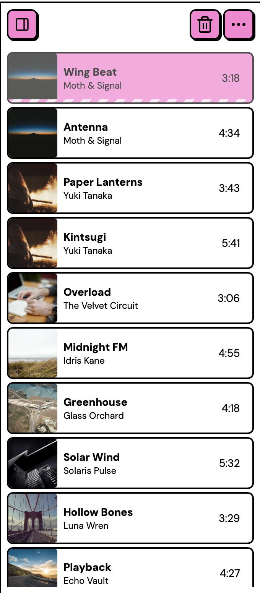

# The queue

The queue is your current listening session. It's the list of tracks Nuclear will play through, shown in the panel on the right side of the window.

<figure><figcaption>
The queue panel
</figcaption></figure>

## Adding tracks

You can add tracks to the queue from search results, album pages, artist pages, and playlists:

- Click the **+** button on a track to append it to the end of the queue
- Use the **three-dot menu** (&#8942;) for more options: **Play now**, **Play next**, or **Add to queue**

Track tables also have **Play all** and **Add all to queue** buttons at the top, which add every track in the list at once.

## Reordering and removing

Drag tracks in the queue panel to reorder them. To remove a track, hover over it and click the remove button.

The queue header has a clear button (trash icon) that removes all tracks and stops playback. You can also save the current queue as a playlist from the queue header menu.

## Stream candidates

When a track starts playing, the streaming provider searches for matching audio and usually finds several possible results. These are the track's **stream candidates**. Nuclear plays the first one that works, moving down the list if a candidate fails. The match isn't always perfect, though: you might get a live version, a remix, or a cover instead of the studio recording.

Right-click a track in the queue to see its stream candidates. The popover shows the currently playing stream with its thumbnail and quality details (quality, bitrate, and codec, when the provider reports them), followed by the full list of candidates with their titles and durations.

If the wrong version is playing, click a different candidate to switch to it. Your choice stays selected for that queue entry until its stream links expire and Nuclear fetches a fresh list. Candidates that couldn't be played are marked as failed.


Candidates are fetched when a track starts playing, so tracks you haven't played yet show "No stream candidates".


## Playback modes

The player bar has shuffle and repeat buttons that control how Nuclear moves through the queue:

- **Repeat off**: plays through the queue in order and stops after the last track
- **Repeat all**: loops back to the first track after the last one
- **Repeat one**: replays the current track indefinitely
- **Shuffle on**: picks a random track from the queue after each track ends

## Persistence

The queue saves to disk automatically. When you close and reopen Nuclear, your queue and position are restored. Tracks that were mid-stream get reset to an idle state so they can be re-fetched when you play them again.
