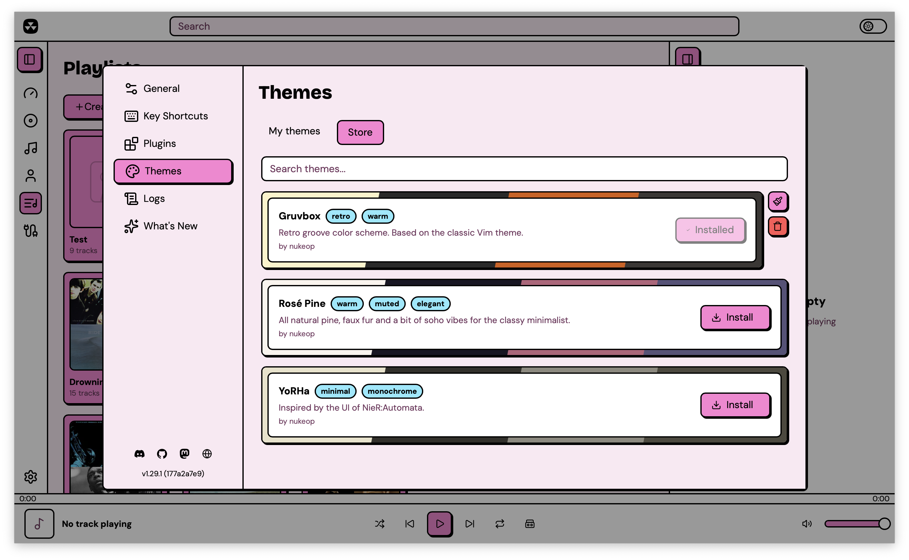
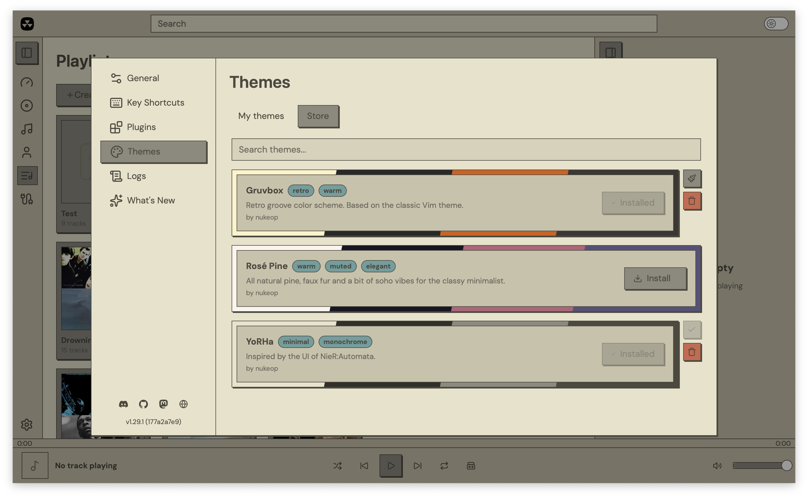

# Theme store

Nuclear has a built-in theme store where you can browse and install themes created by the community. Open Preferences from the sidebar, go to Themes, and switch to the **Store** tab.

<figure><figcaption></figcaption></figure>

## Browsing the store

The Store tab lists themes from the official theme registry at [github.com/NuclearPlayer/theme-registry](https://github.com/NuclearPlayer/theme-registry). Each theme shows a color palette preview (diagonal swatches), its name, description, author, and tags.

The search bar filters by name, description, author, and tags.

## Installing themes

Click Install on any theme. Nuclear downloads the theme file from the registry and saves it locally. The button shows progress during the download, then switches to "Installed" when done.

Installed themes appear in the My Themes tab under a **Store themes** dropdown.

## Applying installed themes

You can apply an installed store theme in two ways: select it from the Store themes dropdown on the My Themes tab, or click the Apply button on a theme in the Store tab.

Selecting a store theme deselects any basic or advanced theme. Only one theme can be active at a time. The active store theme shows a checkmark in the Store tab.

<figure><figcaption></figcaption></figure>

## Uninstalling themes

Click the trash icon on an installed theme in the Store tab. If the theme was active, Nuclear resets to the default theme.

## Where store themes are stored

Store themes live in a `themes/store/` subdirectory inside your app data folder, separate from user-created themes in `themes/`:

- Linux: `~/.local/share/com.nuclearplayer/themes/store/`
- macOS: `~/Library/Application Support/com.nuclearplayer/themes/store/`
- Windows: `%APPDATA%/com.nuclearplayer/themes/store/`

## Creating themes for the store

Store themes are regular [advanced theme](themes-advanced.md) JSON files with extra metadata fields: author, description, tags, and a color palette for the preview. See the [theme registry](https://github.com/NuclearPlayer/theme-registry) for submission instructions and the required format.
