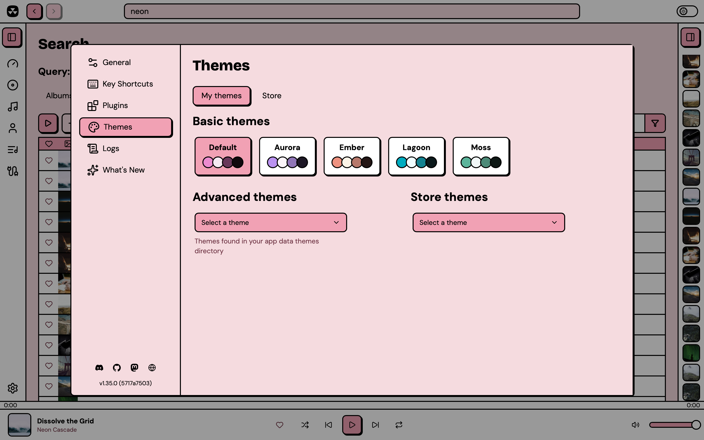

# Advanced themes

## Getting to your themes
Navigate to Nuclear > Preferences > Themes and look for the "Advanced themes" dropdown. Any JSON files you've added to your themes folder will show up here, ready to apply.

<figure><figcaption></figcaption></figure>

Your themes folder lives at:
- Linux: `~/.local/share/com.nuclearplayer/themes`
- macOS: `~/Library/Application Support/com.nuclearplayer/themes`
- Windows: `%APPDATA%/com.nuclearplayer/themes`

When you select a theme, it applies instantly. If you edit the file while it's active, your changes update live in the app.

## Creating your theme
1. Create a new `.json` file with any name you like. Copy the template at the end of this page.
2. Save it to your themes folder (see paths above).
3. Select it from the Advanced themes dropdown in Nuclear.

Here's the basic structure:
```json
{
  "version": 2,
  "name": "My Theme",
  "vars": { /* light mode overrides */ },
  "dark": { /* dark mode overrides */ }
}
```

Both `vars` and `dark` are optional. You only need to include the properties you want to change.

## What you can customize

**Surfaces and their text colors**

There are several surface types, and each one has its own foreground color used for rendering text that's on top of it.

- `background` / `foreground` - the main window, and the basic background of most views
- `muted` / `muted-foreground` - sidebars, top and bottom bars, panels, list rows
- `card` / `card-foreground` - cards and detail header panels
- `popover` / `popover-foreground` - dropdown menus and popovers
- `input` / `input-foreground` - text fields and other form controls
- `primary` / `primary-foreground` - buttons, highlights, active elements

**Bars**

The top bar, the bottom player bar, and the two sidebars use `muted` by default, but you can override their colors individually:

- `topbar` / `topbar-foreground`
- `bottombar` / `bottombar-foreground`
- `sidebar-left` / `sidebar-left-foreground`
- `sidebar-right` / `sidebar-right-foreground`

These variables are optional. Each bar also accepts a `-gradient` variable, for example `sidebar-left-gradient`.

**Seek bar**

Just like the bars, the seekbar can also be styled individually:

- `seekbar` / `seekbar-foreground` - fill (default: `primary`)
- `seekbar-track` / `seekbar-track-foreground` - track (the empty portion) (default: `muted`)

Both accept `-gradient` variables, for example `seekbar-gradient`.

**Accents**

- `accent-green`
- `accent-yellow`
- `accent-purple`
- `accent-blue`
- `accent-orange`
- `accent-cyan`
- `accent-red`

All accents have corresponding foreground colors too. For example, `accent-green-foreground`.

**Borders, rings, overlays**

- `border`, `border-width` (default: `2px` light, `1px` dark)
- `ring` - focus ring color
- `overlay` - dimmer behind dialogs

### Gradients

In addition to using solid colors for surfaces, you can also use gradients.

Every surface has an optional `-gradient` variable that is drawn on top of the solid color. Examples: `background-gradient`, `muted-gradient`, `card-gradient`. Keep the solid color in addition to the gradient. Some elements use it directly, and it will be used when the gradient can't be shown.

### Wallpaper

Wallpaper is a custom image that's drawn underneath the whole player. Use transparent colors to let the wallpaper show through.

Example config: `"wallpaper": "url('https://example.com/my-wallpaper.png')"`.

**Typography**

- `font-size-base` (default: `16px`) - scales the entire UI
- `font-family` - font for standard text
- `font-family-heading` - font for headings
- `font-family-mono` - font for elements that display monospace text, e.g. key shortcuts
- `font-weight-normal`, `font-weight-bold`, `font-weight-extra-bold` - text weights

Custom fonts must be installed on the user's system.

**Corner radii**

- `radius-sm` (default: `4px`), `radius-md` (default: `8px`), `radius-lg` (default: `12px`)

**Shadows**

- `shadow-color`, `shadow-x`, `shadow-y`, `shadow-blur`

## Notes
- `version` must be `2` for new themes. Version `1` themes load and are converted to v2 in memory: no changes are needed. Themes with any other version are ignored.
- Variable names don't need the `--` prefix. Names must consist of lowercase letters, digits, and hyphens.
- Values must not contain `{`, `}`, or `;`.
- You can use hex colors (`#ff0000`), OKLCH (`oklch(70% 0.15 30)`), or any valid CSS color value.
- To use transparency, use this format:
  - For RGBA: `rgba(255, 0, 0, 0.5)`. 0.5 is 50% opacity here.
  - For 8-digit hex: `#ff000080`. The last two digits are the opacity, `80` is 50%.
  - For OKLCH: `oklch(0.5 0.1 30 / 0.5)`. The `/ 0.5` at the end is 50% opacity.

## Color spaces

RGB and OKLCH are two different color spaces that Nuclear supports that you can use to describe the colors you want to use.

To convert between them, you can use this utility: [https://oklch.com](https://oklch.com)

You can read more about OKLCH here: [Why OKLCH is better than RGB](https://evilmartians.com/chronicles/oklch-in-css-why-quit-rgb-hsl)

## Template
A complete template with Nuclear's default values. Copy this and change what you want. The optional variables (gradients, bars, seek bar, wallpaper) have no default value and are listed separately below the template.

```json
{
  "version": 2,
  "name": "My Custom Theme",
  "vars": {
    "background": "oklch(0.9163 0.0361 7.16)",
    "foreground": "oklch(0% 0 0)",

    "muted": "oklch(100% 0 0)",
    "muted-foreground": "oklch(0.42 0.1 5)",

    "card": "oklch(0.8 0.12 4.56)",
    "card-foreground": "oklch(0% 0 0)",

    "popover": "oklch(0.8 0.12 4.56)",
    "popover-foreground": "oklch(0% 0 0)",

    "input": "oklch(100% 0 0)",
    "input-foreground": "oklch(0% 0 0)",

    "primary": "oklch(0.8 0.12 4.56)",
    "primary-foreground": "oklch(0% 0 0)",

    "accent-green": "oklch(0.88 0.13 145)",
    "accent-yellow": "oklch(0.8882 0.15 95)",
    "accent-purple": "oklch(0.82 0.1 300)",
    "accent-blue": "oklch(0.84 0.083 250)",
    "accent-orange": "oklch(0.88 0.085 65)",
    "accent-cyan": "oklch(0.88 0.09 200)",
    "accent-red": "oklch(0.7327 0.2428 18)",

    "accent-green-foreground": "oklch(0% 0 0)",
    "accent-yellow-foreground": "oklch(0% 0 0)",
    "accent-purple-foreground": "oklch(0% 0 0)",
    "accent-blue-foreground": "oklch(0% 0 0)",
    "accent-orange-foreground": "oklch(0% 0 0)",
    "accent-cyan-foreground": "oklch(0% 0 0)",
    "accent-red-foreground": "oklch(100% 0 0)",

    "border": "oklch(0% 0 0)",
    "border-width": "2px",
    "ring": "oklch(0% 0 0)",
    "overlay": "oklch(0% 0 0 / 0.4)",

    "shadow-color": "oklch(0% 0 0)",
    "shadow-x": "2px",
    "shadow-y": "2px",
    "shadow-blur": "0px",

    "font-size-base": "16px",
    "font-family": "'DM Sans', system-ui, -apple-system, sans-serif",
    "font-family-heading": "'Bricolage Grotesque', var(--default-font-family)",
    "font-family-mono": "'Space Mono', ui-monospace, SFMono-Regular, Menlo, Monaco, Consolas, monospace",
    "font-weight-normal": "400",
    "font-weight-bold": "700",
    "font-weight-extra-bold": "800",

    "radius-sm": "4px",
    "radius-md": "8px",
    "radius-lg": "12px"
  },
  "dark": {
    "background": "oklch(0.22 0.03 5)",
    "foreground": "oklch(0.9 0.008 5)",

    "muted": "oklch(0.27 0.035 5)",
    "muted-foreground": "oklch(0.78 0.1 5)",

    "card": "oklch(0.5 0.1 5)",
    "card-foreground": "oklch(0.95 0 0)",

    "popover": "oklch(0.5 0.1 5)",
    "popover-foreground": "oklch(0.95 0 0)",

    "input": "oklch(0.15 0.02 5)",
    "input-foreground": "oklch(0.93 0 0)",

    "primary": "oklch(0.5 0.1 5)",
    "primary-foreground": "oklch(0.95 0 0)",

    "accent-green": "oklch(0.72 0.14 145)",
    "accent-yellow": "oklch(0.78 0.14 95)",
    "accent-purple": "oklch(0.7 0.13 300)",
    "accent-blue": "oklch(0.72 0.12 250)",
    "accent-orange": "oklch(0.75 0.12 65)",
    "accent-cyan": "oklch(0.75 0.11 200)",
    "accent-red": "oklch(0.68 0.14 18)",

    "accent-green-foreground": "oklch(0.15 0 0)",
    "accent-yellow-foreground": "oklch(0.15 0 0)",
    "accent-purple-foreground": "oklch(0.95 0 0)",
    "accent-blue-foreground": "oklch(0.95 0 0)",
    "accent-orange-foreground": "oklch(0.15 0 0)",
    "accent-cyan-foreground": "oklch(0.15 0 0)",
    "accent-red-foreground": "oklch(0.95 0 0)",

    "border": "oklch(0.48 0.04 5)",
    "border-width": "1px",
    "ring": "oklch(0.9 0.008 5)",

    "shadow-x": "0px",
    "shadow-y": "0px"
  }
}
```

## Optional variables

These variables can be omitted, or mixed and matched however you want. Add the ones you want to either `vars` or `dark`.

```json
{
  "version": 2,
  "name": "Optional variables example",
  "vars": {
    "background-gradient": "linear-gradient(180deg, oklch(0.96 0.03 75), oklch(0.9 0.06 30))",
    "muted-gradient": "linear-gradient(180deg, oklch(1 0 0), oklch(0.96 0.015 290))",
    "card-gradient": "linear-gradient(180deg, oklch(0.8 0.13 50), oklch(0.7 0.16 30))",
    "popover-gradient": "linear-gradient(180deg, oklch(0.985 0.015 70), oklch(0.95 0.03 50))",
    "input-gradient": "linear-gradient(180deg, oklch(1 0 0), oklch(0.98 0.01 70))",
    "primary-gradient": "linear-gradient(180deg, oklch(0.72 0.16 45), oklch(0.64 0.18 28))",

    "topbar": "oklch(0.3 0.04 150)",
    "topbar-gradient": "linear-gradient(180deg, oklch(0.33 0.04 150), oklch(0.28 0.04 150))",
    "topbar-foreground": "oklch(0.95 0.01 90)",

    "bottombar": "oklch(0.27 0.04 150)",
    "bottombar-gradient": "linear-gradient(180deg, oklch(0.3 0.04 150), oklch(0.25 0.04 150))",
    "bottombar-foreground": "oklch(0.95 0.01 90)",

    "sidebar-left": "oklch(0.3 0.04 150)",
    "sidebar-left-gradient": "linear-gradient(180deg, oklch(0.32 0.04 150), oklch(0.27 0.04 150))",
    "sidebar-left-foreground": "oklch(0.95 0.01 90)",

    "sidebar-right": "oklch(0.955 0.012 90)",
    "sidebar-right-gradient": "linear-gradient(180deg, oklch(0.97 0.01 90), oklch(0.94 0.014 90))",
    "sidebar-right-foreground": "oklch(0.38 0.05 150)",

    "seekbar": "oklch(0.8 0.17 130)",
    "seekbar-gradient": "linear-gradient(180deg, oklch(0.83 0.17 130), oklch(0.77 0.17 130))",
    "seekbar-foreground": "oklch(0.2 0.04 130)",

    "seekbar-track": "oklch(0.24 0.04 150)",
    "seekbar-track-gradient": "linear-gradient(180deg, oklch(0.22 0.04 150), oklch(0.26 0.04 150))",
    "seekbar-track-foreground": "oklch(0.92 0.01 90)",

    "wallpaper": "url('https://example.com/my-wallpaper.png')"
  }
}
```

The accent surfaces accept `-gradient` variables as well, for example `accent-green-gradient`.
