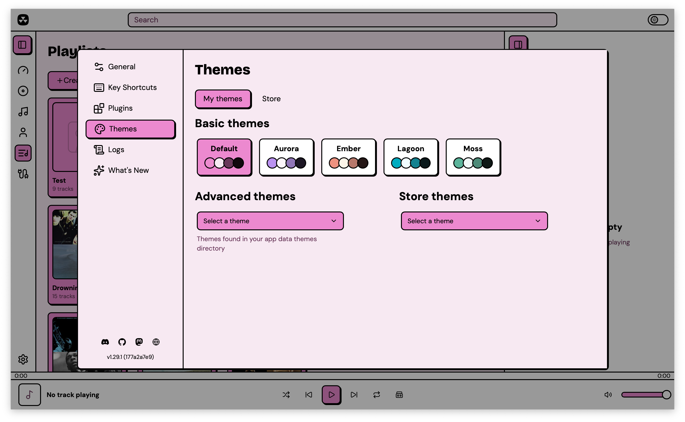

# Basic themes

Basic themes are ready to go right out of the box. Head to Nuclear → Preferences → Themes and you'll see buttons for each preset (like Aurora and Ember). Click any button to change the player's look, or choose "Default" to clear all customizations and return to Nuclear's original style.

<figure><figcaption></figcaption></figure>