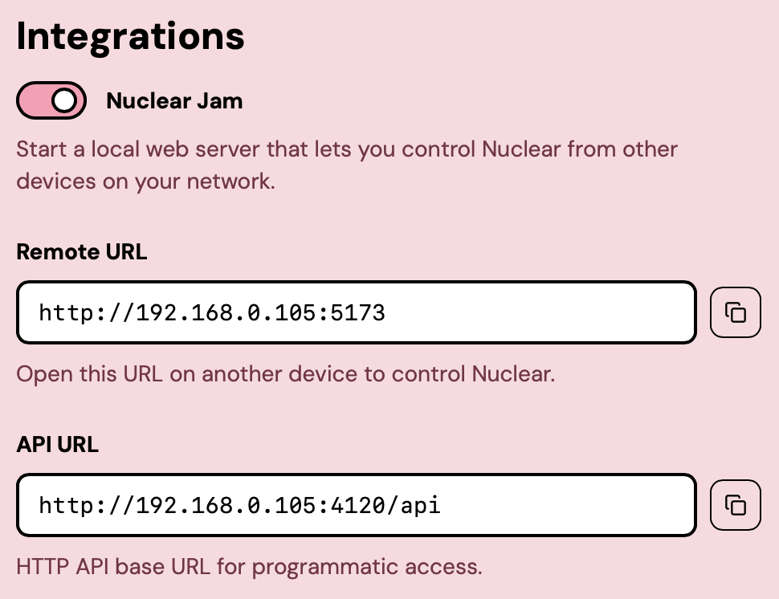
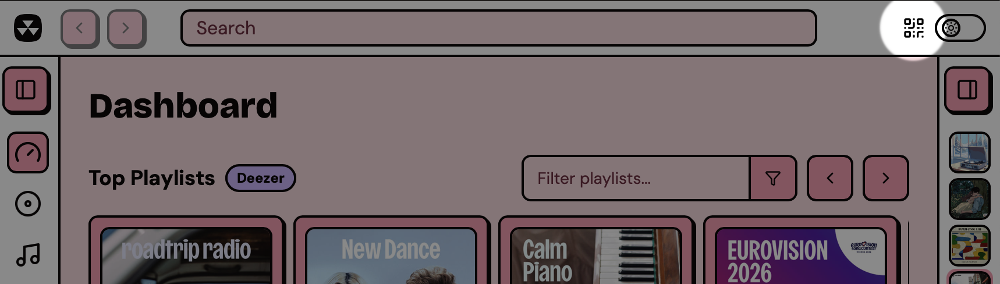
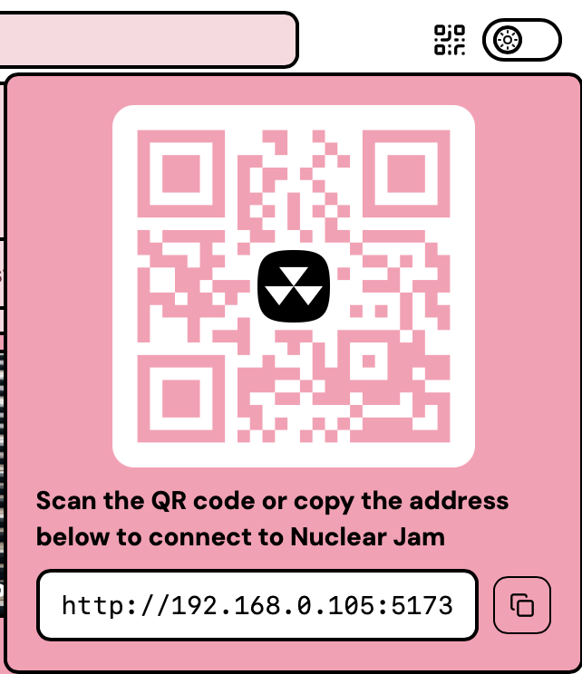
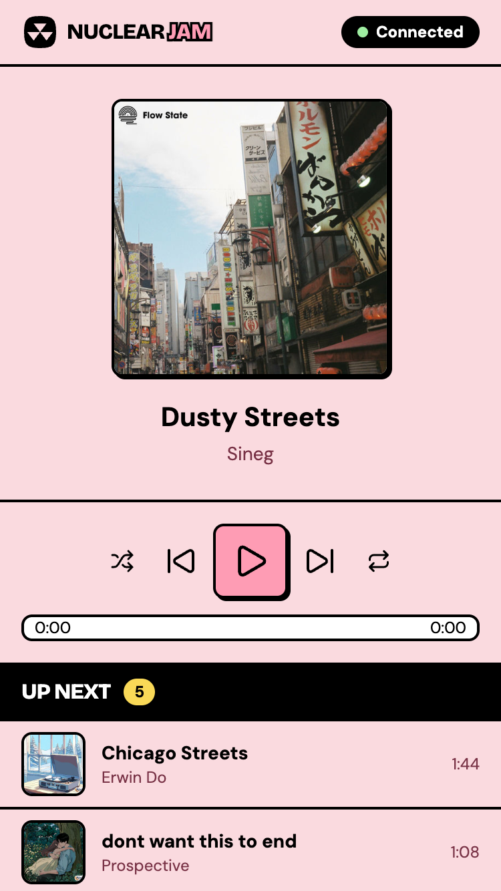

# Remote control

Nuclear Jam turns any device with a web browser into a remote for Nuclear. Pull out your phone, scan a QR code, and you can control playback and see the queue. Handy for parties, cooking, your housemates, and so on.

How does it work? Nuclear can start a small web server that can be accessed on your local network. Your phone (or other devices) connects to your computer directly - no data ever leaves your grasp.

## Enable Nuclear Jam

1. Open Nuclear, then go to Settings, then Integrations.
2. Toggle **Nuclear Jam** on.
3. Two read-only fields appear below the toggle: **Remote URL** and **API URL**. The Remote URL is what you open in a browser to use the remote. The API URL is for scripts and other integrations. See [HTTP API](../integrations/http-api.md) if you want to use it. Intended for programmers.

<figure><figcaption>
Enabling Nuclear Jam in Settings
</figcaption></figure>

The server binds to your LAN address on a port in the 4120-4129 range. If your computer's address is `192.168.1.42`, the Remote URL looks like `http://192.168.1.42:4120`.


Nuclear Jam only listens on your local network. Devices need to be on the same Wi-Fi (or wired LAN) to connect.


## Connect from your phone

Once Jam is on, a small QR code icon appears in the top bar of Nuclear, next to the theme switcher.

<figure><figcaption>
The QR code button in the top bar
</figcaption></figure>

Click it to open a popover with the QR code and the Remote URL.

<figure><figcaption>
The QR code popover
</figcaption></figure>

Scan the QR with your phone's camera, or just type the Remote URL into a browser on any device on the same network to load Nuclear Jam.

## What the remote does

The remote is a single screen with three sections:

- **Now playing** at the top, with cover art, track title, and artist
- **Controls** in the middle: previous, play/pause, next, plus a seek bar, shuffle, and repeat
- **Queue** at the bottom, with the currently playing track highlighted

<figure><figcaption>
Nuclear Jam on a phone
</figcaption></figure>

Anything you do on the remote happens in Nuclear immediately, and conversely, anything that happens in Nuclear (a track ends, the queue changes, you skip from the desktop) shows up on the remote. Multiple devices can connect at the same time and they all stay in sync.

A badge in the header shows the connection status: **Connecting**, **Connected**, **Reconnecting**, or **Disconnected**.
